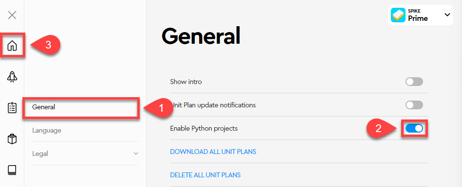
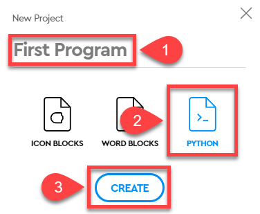
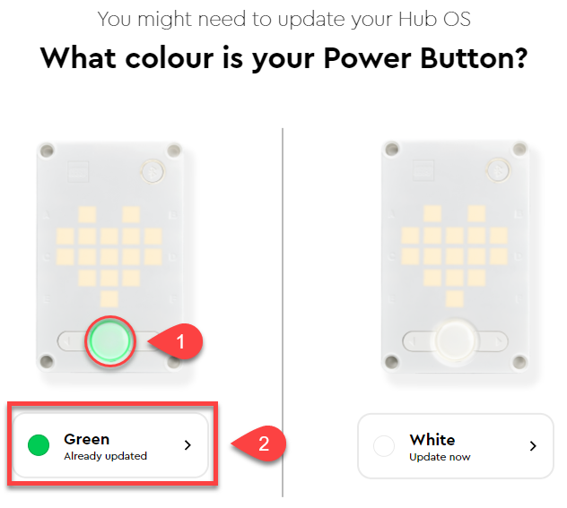
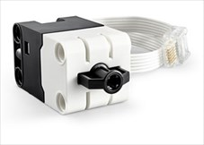
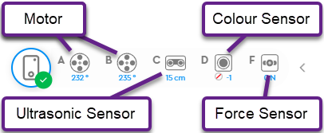

# Introduction

```{topic} In this lesson you will:
- about the Pybricks IDE
- learn how to use Bluetooth to connect to your robot
- write and run your first Spike Prime Python program
```


In this course you will be using three integrated technologies.

- **LEGO Spike Prime**: the hardware ie. the robot components. 
- **Pybricks**: the software, both the software running on the robot, and the IDE
- **Python**: the language you will be programming in. 

These all work together seamlessly, so you will barely recognise that you are using different technologies.

```{admonition} Pybricks
:class: note
Pybricks is in OpenSource Python platform for smart LEGO hubs.

We have replaced the standard LEGO Spike firmware (the code that runs the robot) with Pybricks' firmware. The advantage is that Pybricks is better at running Python. The disadvantage is that you can no longer use the LEGO Spike App to program the robot.
```

## Pybricks IDE

You will be using the Pybricks IDE to program the robot. You can use the IDE in the browser or you can install it as an app on your computer.

To access the Pybricks IDE goto:

**[https://code.pybricks.com/](https://code.pybricks.com/)**

If this is the first time you have visited code.pybricks.com you should be offered to take a **Welcome Tour**, go ahead an take it (if this option didn't show up, just click on the link on the lefthand menu).

Since your robot already has the Pybricks Firmware installed, you can go strait to connecting to the robot.

## Connect Robot

You can connect to the robot by either using a USB cable or Bluetooth. Bluetooth is more convenient, so you will use that.

To connect using Bluetooth:

1. press and hold the power button on the robot (the big one)
2. the hub should light up nine squares and the power button should be flashing blue.
3. Click the **Bluetooth button** on the Pybricks IDE
4. Choose your robot name from the pop-up list (the name is on the front of your robot)
5. Click **Pair**
6. the hub power button should be solid blue, indicating a successful connection

You will be using the Lego Spike App 3 to program our robot, so the first thing you need to do is install the App.

To do this:

- go to the [LEGO Education SPIKE App download](https://education.lego.com/en-au/downloads/spike-app/software/)
- choose your operating system (Windows 11 users choose Windows 10)
- click the **Download** button
- run the downloaded file and keep clicking **next** to install the app
- when the app is installed it should automatically start

## Creating Python Files

Once we are in the app, there are a few steps to accessing the Python coding environment.

1. In the **Select you Spike solution** page, choose the **Spike Prime** option.
2. There are some steps you will only need to do the first time
   1. Click **Got it** on the next screen
   2. Click **DON'T SHOW ME THIS AGAIN** on the next screen, then click the **X**
   3. Click the settings cog icon  at the bottom lefthand corner of the window.
   4. Choose **General** and then click the **Enable Python projects** toggle.
   5. Finally, click the home icon



3. Click **New Project**
4. Give your project a name (First Program), click Python and then click CREATE



5. Finally we will delete all the code that has been prewritten for us. Hold **Ctrl** + **A** (**command** + **A** on macs) and then **delete**.

## Connect to Robot

You will use Bluetooth to connect to your robot. 

1. Click the yellow **Connect** icon in the top left of the screen
2. Turn you robot on by pressing and briefly holding the power button
3. Then click on **Green already updated**



4. Follow the instruction to **turn on Bluetooth**
5. Connect to your robot by choosing it's name from the list

## Check Configuration

Your robot has three sensors modules and two motors modules connected. 

| Module | Port | Purpose | Image |
| --- | --- | --- | --- |
| Ultrasonic Sensor | C | Detect the distance to object in front |  |
| Force Sensor | F | Detect the amount of pressure applied |  |
| Colour Sensor | D | Detect the colour of an object, or the amount of light reflected |  |
| Motor | A B | Turns in response to commands from hub | 

To successfully follow these tutorials, you need to make sure that they are all connected to the correct hub ports.

To check the port that modules are connected to, look at the top of the screen beside the connection icon. Make sure that each module is connected to the correct port. It should look like the image below.



## First Program

Our final check is for you to run your first program.

