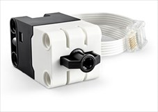
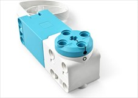

# Setup

```{topic} In this lesson you will:
- learn about the Pybricks IDE
- learn how to use Bluetooth to connect to your robot
- run your first Spike Prime Python program to check your robot configuration
```


In this course you will use three technologies that work together:

- **LEGO Spike Prime**: the robot hardware
- **Pybricks**: the software that runs on the robot and the IDE you use to program it
- **Python**: the programming language you will write

```{admonition} Pybricks
:class: note
We have replaced the standard LEGO Spike firmware with Pybricks firmware because it runs Python better. The trade-off is that you can no longer use the LEGO Spike App to program the robot.
```

```{admonition} Firmware
:class: note
Firmware is like a robot's brain — special software built into the device that makes it work correctly every time you turn it on.
```

## Pybricks IDE

The Pybricks IDE is where you will write and run your programs. You can use it in a browser or install it as an app — either works fine.

**[https://code.pybricks.com/](https://code.pybricks.com/)**

If this is your first visit, take the **Welcome Tour** when prompted. If it doesn't appear, click the link in the left-hand menu.

## Connect Robot

1. Press and hold the power button on the hub (the big centre button)
2. The hub should light up nine squares and the power button should flash blue
3. Click the **Bluetooth button** in the Pybricks IDE
4. Choose your robot's name from the pop-up list (the name is on the front of the robot)
5. Click **Pair**
6. The power button should turn solid blue — you're connected!

## Check Configuration

Your robot has three sensors and two motors connected to specific ports. The code you are about to run will confirm everything is plugged into the right place.

| Device | Port | Purpose | Image |
| --- | --- | --- | --- |
| Ultrasonic Sensor | C | Detect the distance to object in front |  |
| Force Sensor | B | Detect the amount of pressure applied |  |
| Colour Sensor | D | Detect the colour of an object, or the amount of light reflected |  |
| Motor | E F | Turns in response to commands from hub | 

### Run the check

1. In the Pybricks IDE, click **Create a new file** and choose the Prime Hub icon
2. Name the file `check_config.py`
3. Copy and paste the code below
4. Click the **Run** button (the green play button)

```{literalinclude} ./python_files/check_config.py
:linenos:
```

### Checking the ports devices

Don't worry about understanding the code, you will learn that through these tutorials.

What you need to check is the output in the terminal (the panel at the bottom of the IDE). It should be the same as below:

```
Hub configuration
Port.E :  SPIKE Medium Angular Motor
Port.F :  SPIKE Medium Angular Motor
Port.C :  SPIKE Ultrasonic Sensor
Port.D :  SPIKE Color Sensor
Port.B :  SPIKE Force Sensor
```

If anything is different, unplug and move the cables until each device is in its correct port.

### Checking the motors

The robot should turn 360° **clockwise**. If it turns **counter-clockwise**, swap the cables in **Port E** and **Port F**.

- left motor → **Port E**
- right motor → **Port F**

## Start Exploring

You're all set up! Keep these tips in mind as you work through the tutorials:

1. **Type the code** — it's tempting to copy and paste, but typing helps it stick.
2. **Use PRIMM** — predict what the code will do before you run it, then investigate and modify it.
3. **Read the callout boxes** — they explain key concepts and coding practices.
4. **Remix and build** — treat the code like LEGO. Break it apart, mash pieces together, and make something new.

```{admonition} PRIMM
Throughout this course we use the **PRIMM** process: **Predict**, **Run**, **Investigate**, **Modify**, **Make**.

- **Predict**: What do you think the code will do before you run it?
- **Run**: Run it and compare to your prediction.
- **Investigate**: Go through the code line by line — what does each part do?
- **Modify**: Change something and see what happens.
- **Make**: Use what you've learned to build something new.
```