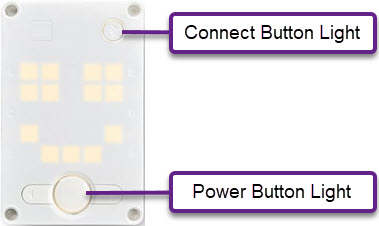

# Hub Outputs

## Light

The light module allows you to program the colour of the power button light and connect button light.



```{code-block} python
:linenos:
from hub import light
import color

light.color(light.POWER, color.PURPLE)
light.color(light.CONNECT, color.YELLOW)
```