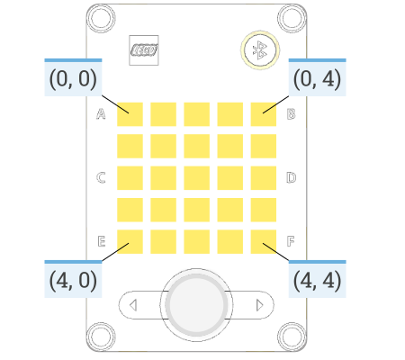

# Hub Outputs

```{topic} In this lesson you will:
- explore the output features of the Spike Prime Hub
- change the status light colour
- display images and text on the light matrix
- make sounds using the hub speaker
```

```{admonition} Pybrick Documentation
:class: important
All Pybricks commands are listed in the **[Pybricks documentation](https://docs.pybricks.com/en/stable/index.html)**. You can also find it in the right-hand panel of the Pybricks IDE.
```

The Spike Prime Hub has three ways to produce output:

- Hub status light
- Light matrix
- Speaker

```{admonition} Output and Input
:class: note
Think of a robot exploring a room on its own.

When it uses sensors to detect a wall ahead — that's **input**. The robot is collecting information.

When it turns left to avoid the wall — that's **output**. The robot is acting on that information.

**Input** = gathering information. **Output** = doing something with it.
```

## The Hub Status Light

The status light sits around the power button. By default it is turned off.


### Status Light Functions

| Function | What it does |
|---|---|
| **[`light.on(color)`](https://docs.pybricks.com/en/stable/hubs/primehub.html#pybricks.hubs.PrimeHub.light.on)** | Turns the light on at a chosen colour |
| **[`light.off()`](https://docs.pybricks.com/en/stable/hubs/primehub.html#pybricks.hubs.PrimeHub.light.off)** | Turns the light off |
| **[`light.blink(color, durations)`](https://docs.pybricks.com/en/stable/hubs/primehub.html#pybricks.hubs.PrimeHub.light.blink)** | Blinks the light on and off at set time intervals |
| **[`light.animate(colors, interval)`](https://docs.pybricks.com/en/stable/hubs/primehub.html#pybricks.hubs.PrimeHub.light.animate)** | Cycles through a list of colours, one at a time |

### Status Light Example

1. **Create** a new file called `hub_light.py`
2. **Type** the code below into the file
3. **Predict** what you think will happen
4. **Run** your code

```{literalinclude} ./python_files/hub_output_status_light.py
:linenos:
```

```{admonition} Investigate
- **lines 3–7** → imports all Pybricks commands for your robot
- **lines 9–10** → creates a PrimeHub object and names it `hub`
- **line 14** → starts an endless loop
- **line 15** → sets the status light to `MAGENTA`
  - see the **[colour documentation](https://docs.pybricks.com/en/stable/parameters/color.html#color)** for all available colours
- **line 16** → waits 1000 milliseconds (1 second)
- **line 17** → blinks `RED`: on 500ms → off 250ms → on 500ms → off 250ms
- **line 18** → waits 1500 milliseconds
- **line 19** → animates through `GREEN`, `WHITE`, then `ORANGE`, each showing for 1000ms
- **line 20** → waits 3000 milliseconds
- **line 21** → turns the light off
- **line 22** → waits 1000 milliseconds
```

```{admonition} Modify
:class: caution
- Can you display different colours?
- Can you change the timing of the blink?
- Can you change the timing of the animation?
- What happens if you put a `#` in front of all the `wait` lines to comment them out?
```

---

## Light Matrix

The hub has a 5×5 grid of lights called the light matrix. You can display text, icons, or control individual pixels using their row and column coordinates.



### Light Matrix Functions

| Function | What it does |
|---|---|
| **[`display.orientation(up)`](https://docs.pybricks.com/en/stable/hubs/primehub.html#pybricks.hubs.PrimeHub.display.orientation)** | Sets which side of the hub is considered "up" |
| **[`display.off()`](https://docs.pybricks.com/en/stable/hubs/primehub.html#pybricks.hubs.PrimeHub.display.off)** | Turns off all pixels |
| **[`display.pixel(row, column, brightness=100)`](https://docs.pybricks.com/en/stable/hubs/primehub.html#pybricks.hubs.PrimeHub.display.pixel)** | Turns on a single pixel at a set brightness |
| **[`display.icon(icon)`](https://code.pybricks.com/en/stable/hubs/primehub.html#pybricks.hubs.PrimeHub.display.icon)** | Displays a built-in icon — **[see the full icon list](https://docs.pybricks.com/en/stable/parameters/icon.html?highlight=icon#pybricks.parameters.Icon)** |
| **[`display.animate(matrices, interval)`](https://code.pybricks.com/en/stable/hubs/primehub.html#pybricks.hubs.PrimeHub.display.animate)** | Plays an animation using a list of icons |
| **[`display.number(number)`](https://code.pybricks.com/en/stable/hubs/primehub.html#pybricks.hubs.PrimeHub.display.number)** | Displays a number from −99 to 99 |
| **[`display.char(char)`](https://code.pybricks.com/en/stable/hubs/primehub.html#pybricks.hubs.PrimeHub.display.char)** | Displays a single character or symbol |
| **[`display.text(text, on=500, off=50)`](https://code.pybricks.com/en/stable/hubs/primehub.html#pybricks.hubs.PrimeHub.display.text)** | Scrolls a text string, one character at a time |

### Light Matrix Example

1. **Create** a new file called `light_matrix.py`
2. **Type** the code below into the file
3. **Predict** what you think will happen
4. **Run** your code

```{literalinclude} ./python_files/hub_output_light_matrix.py
:linenos:
```

```{admonition} Investigate
- **lines 3–7** → imports all Pybricks commands — make sure `Icon` is included at the end of **line 5**
- **lines 9–10** → creates a PrimeHub object and names it `hub`
- **line 15** → starts an endless loop
- **lines 16–27** → rotates the display orientation and shows an up arrow for each direction
- **lines 29–30** → turns the display off for 1 second
- **lines 32–37** → lights up individual pixels to draw a "meh" face
- **lines 38–40** → turns the display off for 1 second
- **line 42** → creates a list of icons
- **line 43** → animates through each icon in the list, showing each for 500ms
- **line 44** → waits 1 second
- **lines 46–47** → turns the display off for 1 second
- **lines 49–56** → displays numbers and characters one at a time
- **lines 58–59** → turns the display off for 1 second
- **line 61** → scrolls the text `C3PO` across the display
- **lines 63–64** → turns the display off for 2 seconds
```

```{admonition} Modify
:class: caution
- Can you make `Icon.HAPPY` spin around all four display orientations?
- Can you redesign the "meh" face so the mouth fills the whole bottom row and the eyes are 2×2 pixels?
- What happens if you comment out all the `wait` lines?
```

---

## Speaker

The hub has a built-in speaker for playing tones and music.

### Speaker Functions

| Function | What it does |
|---|---|
| **[`speaker.volume(volume)`](https://docs.pybricks.com/en/stable/hubs/primehub.html#pybricks.hubs.PrimeHub.speaker.volume)** | Sets the volume level. If no value is given, returns the current volume |
| **[`speaker.beep(frequency=500, duration=100)`](https://docs.pybricks.com/en/stable/hubs/primehub.html#pybricks.hubs.PrimeHub.speaker.beep)** | Plays a single beep at a given pitch and length |
| **[`speaker.play_notes(notes, tempo=120)`](https://docs.pybricks.com/en/stable/hubs/primehub.html#pybricks.hubs.PrimeHub.speaker.play_notes)** | Plays a sequence of musical notes at a set tempo |

### Speaker Example

1. **Create** a new file called `speaking.py`
2. **Type** the code below into the file
3. **Predict** what you think will happen
4. **Run** your code

```{literalinclude} ./python_files/hub_output_speaker.py
:linenos:
```

```{admonition} Investigate
- **lines 3–7** → imports all Pybricks commands for your robot
- **lines 9–10** → creates a PrimeHub object and names it `hub`
- **line 15** → starts an endless loop
- **line 17** → sets the volume to 100%
- **lines 18–19** → reads the current volume and displays it on the light matrix
- **line 20** → plays a 440Hz beep for 500ms
- **line 22** → sets the volume to 50%
- **lines 23–24** → reads the current volume and displays it on the light matrix
- **line 25** → plays a 440Hz beep for 500ms
- **lines 27–35** → stores the notes for *Oh When the Saints* in a list
- **line 37** → plays the notes at 180 BPM
```

```{admonition} Modify
:class: caution
- What is the lowest volume you can still hear?
- What is the lowest pitch beep you can hear?
- What is the highest pitch beep you can hear?
- Can you program the hub to play a different tune?
```
