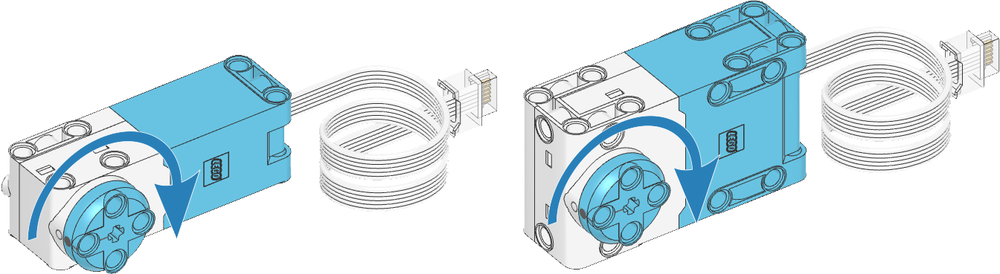

# Motors

```{topic} In this lesson you will:
- the different methods of moving the Spike Prime motors
- make a motor run contiunously
- make a motor run for a specific time
- make a motor turn a specific number of degrees
```

```{admonition} Pybrick Documentation
:class: important
To explore all Pybricks' features check the **[Pybricks documentaion](https://docs.pybricks.com/en/stable/index.html)**. This can also be seen in the right-hand panel of the Pybricks IDE.
```

Although your robot only has on type of motor, the LEGO Spike Prime kit actually has two:

- Medium Angular Motor
- Medium Angular Motor



Both motors are run using the same code. The only difference is the relative power.

```{admonition} DC Motor vs Encoded Motors
:class: important
The Spike Prime motors are called Angular, because you can program them to turn an exact number of degrees. This is possible because they have a built-in sensor called an encoder. Encoders record how many degrees the motor has turned.

Motors without encoders are called DC motors (direct current). The only programming options DC motors provide are turn on and turn off.
```

## Initialisation

Before you can program the motors, you need to create initialize a motor object for each motor you wish to use.

This is achieved through calling the [`Motor` class](https://code.pybricks.com/static/docs/v2.7.0/pupdevices/motor.html#pybricks.pupdevices.Motor). You will need to pass minimum arguments:

- port &rarr; the port the motor is plugged into. You will need to use one of Pybricks' constants (eg. `Port.A`)
- positive direction &rarr; this is the direction you want the wheel to turn when you enter a positive speed value. You will need to use one of Pybricks' constants (eg. `Direction.CLOCKWISE`)

For example, to initialize the right motor on your robot your would use:

`right_motor = Motor(Port.B, Direction.CLOCKWISE)`

## Motor Running Forever

### Motor Running Forever Functions

There are two functions that make the motors run forever:

- **[`run(speed)`](https://code.pybricks.com/static/docs/v2.7.0/pupdevices/motor.html#pybricks.pupdevices.Motor.run)** &rarr; Runs the motor at a constant speed.
- **[`dc(duty)`](https://code.pybricks.com/static/docs/v2.7.0/pupdevices/motor.html#pybricks.pupdevices.Motor.dc)** &rarr; Rotates the motor at a given duty cycle (also known as “power”).

### Motor Running Forever Examples

Time to explore how these two functions can be used.

1. **Create** a new file called `motors_run_forever.py`
2. **Type** the code below into the file
3. **Predict** what you think will happen.
4. **Run** your code

```{literalinclude} ./python_files/motors_output_run.py
:linenos:
```

**Investigating** this code:

- **lines 3 - 7** &rarr; imports all the Pybricks command for use with your robot
- **lines 10 - 12** initialises the components of your robot
  - **line 10** &rarr; initialise the hub
  - **line 11** &rarr; initialise the left motor in port A
    - Positive direction is counter-clockwise &rarr; look at the left wheel, which direction does it need to turn for your robot to move forwards?
  - **line 12** &rarr; initialise the right motor in port B
    - Positive direction is clockwise &rarr; look at the right wheel, which direction does it need to turn for your robot to move forwards?
- **line 15** &rarr; creates a infinite loop
- **line 16** &rarr; sets `left_motor` to `1000`. This turns the motor at 1000 degrees a second
- **line 17** &rarr; sets `right_motor` to `1000`. This turns the motor at 1000 degrees a second
- **line 18** &rarr; makes the robot wait for a second before moving onto the next command
- **line 20** &rarr; sets `left_motor` to `50`. This turns the motor at 50% power
- **line 21** &rarr; sets `right_motor` to `50`. This turns the motor at 50% power

**Modify** the code:

- what happens if both motors' positive direction is the same?
- what happens if you comment out all the wait commands?
- work out how many degrees per second is produced by a motor at 50% power.
