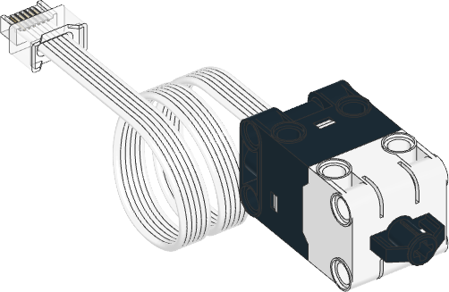

# Force Sensor

```{topic} In this lesson you will:
- detect if the sensor has been touched
- measure how much force has been applied to the sensor
- measure how far the sensor has been depressed
- detect if the force applied to the sensor exceeds a threshold
```

```{admonition} Pybrick Documentation
:class: important
To explore all Pybricks' features check the **[Pybricks documentaion](https://docs.pybricks.com/en/stable/index.html)**. This can also be seen in the right-hand panel of the Pybricks IDE.
```

The force sensor is like a more complicated button. Not only can it detect if it has been pressed, it can also measure how hard it has been pressed, or, in other words, the force applied to it. The measuring element is the black 'button' on the front of the sensor.



To initialise the force sensor you must call the `ForceSensor()` class and nominate it's port. For example, with the robot you would use:

`force_sensor = ForceSensor(Port.A)`

## Force Sensor Functions

Pybrick provides four functions to interact with the force sensor:

- **[`force()→ float: N`](https://docs.pybricks.com/en/stable/pupdevices/forcesensor.html#pybricks.pupdevices.ForceSensor.force)** &rarr; Measures the force (N) exerted on the sensor.
- **[`distance()→ float: mm`](https://docs.pybricks.com/en/stable/pupdevices/forcesensor.html#pybricks.pupdevices.ForceSensor.distance)** &rarr; Measures by how much (mm) the sensor button has moved.
- **[`pressed(force=3)→ bool`](https://docs.pybricks.com/en/stable/pupdevices/forcesensor.html#pybricks.pupdevices.ForceSensor.pressed)** &rarr; Checks if the sensor button is pressed. Has a minimum force to be considered pressed.
- **[`touched()→ bool`](https://docs.pybricks.com/en/stable/pupdevices/forcesensor.html#pybricks.pupdevices.ForceSensor.touched)** &rarr; Checks if the sensor is touched. Detects slight movements of the button

## Force Sensor Example

Check how to use each of these functions by using the following code.

1. **Create** a new file called `force_sensor.py`
2. **Type** the code below into the file
3. **Predict** what you think will happen.
4. **Run** your code

```{literalinclude} ./python_files/force_sensor.py
:linenos:
```

```{admonition} Investigate
- **lines 3 - 7** &rarr; imports all the Pybricks command for use with your robot
- **line 10** &rarr; initialises the hub
- **line 11** &rarr; initialises the force sensor
- **line 14** &rarr; creates an infinite loop
- **line 15** &rarr; takes the force reading, rounds it to one decimal place and then stores it in `force_reading`
- **line 16** &rarr; takes the distance reading, rounds it to one decimal place and then stores it in `distance_reading`
- **line 17** &rarr; checks if the sensor is experiencing more than 3N of force and stores result in `is_pressed`
- **line 18** &rarr; checks if the sensor has been touched and stores the result in `is_touched`
- **lines 20 - 25** &rarr; prints the values that have been stored
    - this is actually one print statement split over multiple line to make it easier to read
```

```{admonition} Modify
:class: caution
- what happens if you change the `pressed` threshold to `11`?
- what happens if you change the `pressed` threshold to `0`?
```