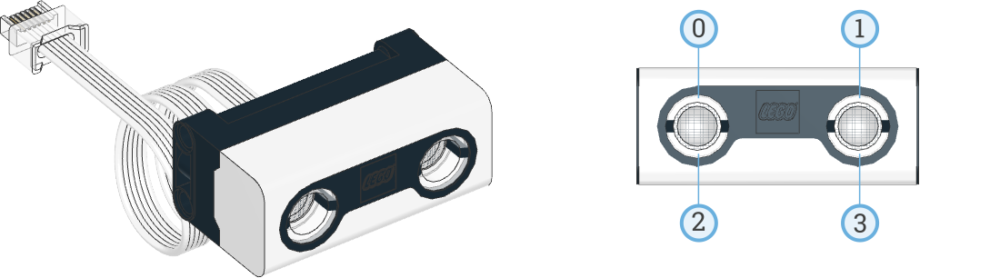

# Distance Sensor

```{topic} In this lesson you will:
- detect the colour of a surface or light source
- detect the amount of light reflected from a surface
- detect the amount of ambient light
```

```{admonition} Pybrick Documentation
:class: important
To explore all Pybricks' features check the **[Pybricks documentaion](https://docs.pybricks.com/en/stable/index.html)**. This can also be seen in the right-hand panel of the Pybricks IDE.
```

The Distance Sensor measures distance to an object or surface using ultrasound. The sensor works by sending out high frequency sound waves that bounce off any object in range, and measuring how long it takes the sound to return to the sensor. The Distance Sensor can also be used as a light source, with four LED segments around the "eyes" that can be controlled individually.



To initialise the distance sensor you must call the `UltrasonicSensor()` class and nominate it's port. For example, with the robot you would use:

`distance_sensor = UltrasonicSensor(Port.C)`

## Distance Sensor Functions

There are two functions you can use to get readings from the distance sensor:

- **[`distance()→ int: mm`](https://code.pybricks.com/static/docs/v2.7.0/pupdevices/ultrasonicsensor.html#pybricks.pupdevices.UltrasonicSensor.distance)** &rarr; Measures the distance (mm) between the sensor and an object using ultrasonic sound waves.
- [`presence()→ bool`](https://code.pybricks.com/static/docs/v2.7.0/pupdevices/ultrasonicsensor.html#pybricks.pupdevices.UltrasonicSensor.presence)

Pybricks also has two functions to work with the inbuild lights:

- **[`lights.on(brightness)`](https://code.pybricks.com/static/docs/v2.7.0/pupdevices/ultrasonicsensor.html#pybricks.pupdevices.UltrasonicSensor.lights.on)** &rarr; Turns on the lights at the specified brightness.
- **[`lights.off()`](https://code.pybricks.com/static/docs/v2.7.0/pupdevices/ultrasonicsensor.html#pybricks.pupdevices.UltrasonicSensor.lights.off)** &rarr; Turns off all the lights.

## Distance Sensor Example

Use the code below to understand how the functions work.

1. **Create** a new file called `distance_sensor.py`
2. **Type** the code below into the file
3. **Predict** what you think will happen.
4. **Run** your code:

```{literalinclude} ./python_files/distance_sensor.py
:linenos:
```

```{admonition} Investigate
- **lines 3 - 7** &rarr; imports all the Pybricks command for use with your robot
- **line 10** &rarr; initialises the hub
- **line 11** &rarr; initialises the distance sensor
- **line 14** &rarr; create main loop
- **line 15** &rarr; get a distance reading from the sensor and store in `distance`
- **line 16** &rarr; store in `present` if there are any other ultrasonic sensors around
- **line 18** &rarr; print the values in `distance` and `present`
- **line 20** &rarr; turn lights off
- **line 21** &rarr; wait 100 milliseconds
- **line 22** &rarr; turn lights on to 100%
```

```{admonition} Modify
:class: caution
- what happens when your comment out **line 21**?
- what is the maximum distance reading?
- what is the minimum distance reading?
```
