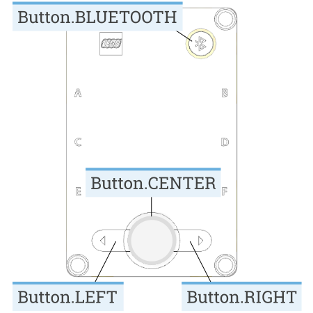

# Buttons

!!! learn "On this page we will learn"
    - how to check which hub buttons are being pressed
    - how to use `pressed()` to make the robot react to a button

The hub has four buttons: **left**, **right**, **centre** and **Bluetooth**. Our programs can check which buttons are being pressed.

Possible uses:

- starting a robot's run when we're ready
- choosing between programs or modes
- changing a setting, such as speed, without editing the code
- controlling the robot by hand while testing



## Connect it

The buttons are built into the hub, so we don't need to connect anything.

- See [Setup](../start/setup.md#create-and-run-a-program) for how to create and run each example.
- In code, the buttons are `Button.LEFT`, `Button.RIGHT`, `Button.CENTER` and `Button.BLUETOOTH`.

!!! warning "The centre button stops the program"
    Pressing the centre button stops the running program, so we normally use the left, right and Bluetooth buttons as inputs.

## Set it up

The buttons are part of the hub. We import the Pybricks commands, then create the hub in the setup. The example also uses `Icon`, which is added to the end of line 3:

```python linenums="1"
from pybricks.hubs import PrimeHub
from pybricks.pupdevices import Motor, ColorSensor, UltrasonicSensor, ForceSensor
from pybricks.parameters import Button, Color, Direction, Port, Side, Stop, Icon
from pybricks.robotics import DriveBase
from pybricks.tools import wait, StopWatch

# Setup
hub = PrimeHub()
```

## Methods

| Method | Parameters | Returns | Description |
| --- | --- | --- | --- |
| `hub.buttons.pressed()` | none | set of `Button`s | The buttons being pressed right now |

### `pressed()`

Returns a **set** of the buttons being pressed right now. A set is a group of values with no order. If no buttons are pressed, the set is empty. We use `in` to check whether a button is in the set.

```python linenums="1"
--8<-- "examples/hub/buttons/pressed/main.py"
```

!!! primm "PRIMM"
    1. **Predict** what you think will happen. Be specific.
    2. **Run** the program. Press and hold the left button, then let it go.
    3. Time to **investigate** the code. What does each line do?

??? note "Code explanation"
    - **lines 1–5** → import the Pybricks commands for the hub, motors, sensors, settings and timing, including `Icon` at the end of line 3.
    - **line 8** → creates the hub and names it `hub`.
    - **line 11** → starts the main loop, which repeats forever.
    - **line 12** → gets the set of buttons being pressed right now and stores it in `pressed`.
    - **line 13** → checks if the left button is in `pressed`…
    - **line 14** → …if it is, shows a left arrow.
    - **line 15** → if it isn't…
    - **line 16** → …turns the display off.

!!! tip "One press, many loops"
    The main loop runs thousands of times a second, so one press of a button is seen by many loops in a row. If each press should only count once, add a short `wait()`, such as `wait(250)`, after handling the press.

## Documentation

Documentation is the official guide written by the people who made the code library, and we can use it to look up every method and its parameters, including ones that aren't covered on this page.

- [Pybricks — Prime Hub buttons](https://docs.pybricks.com/en/stable/hubs/primehub.html#pybricks.hubs.PrimeHub.buttons.pressed)

## Exercises

!!! primm "PRIMM"
    Time to **modify** the code and see what happens.

Starter files are in the `buttons` folder of your tutorial files. Solutions are on the [Exercise Solutions](../reference/solutions.md#buttons) page.

### Exercise 1

Starter: `buttons/ex1_more_buttons`

Can you change the program so it also shows a right arrow when the right button is pressed, and the letter `B` when the Bluetooth button is pressed?

### Exercise 2

Starter: `buttons/ex2_counter`

Can you create a counter? It should:

- start at `0`
- add 1 when the left button is pressed
- take away 1 when the right button is pressed
- show the count on the display

### Exercise 3

Starter: `buttons/ex3_both_buttons`

Can you change the program so it shows a down arrow when the left and right buttons are pressed at the same time?
