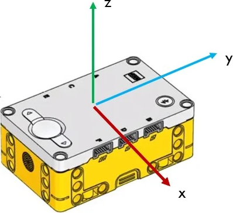

# IMU

!!! learn "On this page we will learn"
    - what the IMU is and what it can sense
    - how to find which side of the hub is facing up
    - how to measure how much the hub is tilted
    - how to measure and reset how far the hub has turned

The hub has an **IMU** (inertial measurement unit) inside it. The IMU senses how the hub is moving and which way it is facing, so our programs can tell which side is up, how much it is tilted and how far it has turned.

Possible uses:

- detecting when the robot has tipped over
- balancing or levelling
- turning the robot an exact number of degrees
- keeping the robot driving in a straight line (see [Gyro Driving](../drivebase/gyro-driving.md))

## Connect it

The IMU is built into the hub, so we don't need to connect anything.

- See [Setup](../start/setup.md#create-and-run-a-program) for how to create and run each example.
- The IMU measures around three **axes**: x, y and z, as shown below.



Turning around each axis has its own name:

- **Roll** → turning around the x-axis, like a plane dipping one wing.
- **Pitch** → turning around the y-axis, like a plane pointing its nose up or down.
- **Yaw** → turning around the z-axis, like a car turning left or right. In Pybricks, the yaw angle is called the **heading**.

!!! warning "Keep the hub still when the program starts"
    The IMU calibrates itself while the hub sits still for a few seconds. If the hub is moving when the program starts, the readings can be less accurate.

## Set it up

The IMU is part of the hub. We import the Pybricks commands, then create the hub in the setup:

```python linenums="1"
from pybricks.hubs import PrimeHub
from pybricks.pupdevices import Motor, ColorSensor, UltrasonicSensor, ForceSensor
from pybricks.parameters import Button, Color, Direction, Port, Side, Stop
from pybricks.robotics import DriveBase
from pybricks.tools import wait, StopWatch

# Setup
hub = PrimeHub()
```

## Methods

| Method | Parameters | Returns | Description |
| --- | --- | --- | --- |
| `hub.imu.up()` | none | `Side` | Which side of the hub is facing up |
| `hub.imu.tilt()` | none | tuple (pitch, roll) in degrees | How far the hub is tilted |
| `hub.imu.heading()` | none | float (degrees) | How far the hub has turned since the program started |
| `hub.imu.reset_heading(angle)` | `angle`: degrees | none | Sets the heading to a new value |

### `up()`

Returns which side of the hub is facing up: `Side.TOP`, `Side.BOTTOM`, `Side.LEFT`, `Side.RIGHT`, `Side.FRONT` or `Side.BACK`. The top is the side with the light matrix.

```python linenums="1"
--8<-- "examples/hub/imu/up/main.py"
```

!!! primm "PRIMM"
    1. **Predict** what you think will happen. Be specific.
    2. **Run** the program. Turn the hub so each side faces up in turn, and watch the terminal.
    3. Time to **investigate** the code. What does each line do?

??? note "Code explanation"
    - **lines 1–5** → import the Pybricks commands for the hub, motors, sensors, settings and timing.
    - **line 8** → creates the hub and names it `hub`.
    - **line 11** → starts the main loop, which repeats forever.
    - **line 12** → prints which side of the hub is facing up.
    - **line 13** → waits 200 milliseconds so the terminal isn't flooded with readings.

### `tilt()`

Returns the pitch and roll angles as a **tuple**. A tuple is a group of values in brackets, such as `(10, -5)`. We can store each value in its own variable by writing two names before the `=`.

```python linenums="1"
--8<-- "examples/hub/imu/tilt/main.py"
```

!!! primm "PRIMM"
    1. **Predict** what you think will happen. Be specific.
    2. **Run** the program. Tilt the hub forwards, backwards and to each side.
    3. Time to **investigate** the code. What does each line do?

??? note "Code explanation"
    - **lines 1–5** → import the Pybricks commands for the hub, motors, sensors, settings and timing.
    - **line 8** → creates the hub and names it `hub`.
    - **line 11** → starts the main loop, which repeats forever.
    - **line 12** → gets the tilt tuple and stores the first value in `pitch` and the second value in `roll`.
    - **line 13** → prints the pitch and roll angles.
    - **line 14** → waits 200 milliseconds before the next reading.

### `heading()`

Returns how many degrees the hub has turned around the z-axis since the program started. Turning **clockwise** (seen from above) makes the heading bigger, and turning anticlockwise makes it smaller. The heading doesn't reset after a full turn: two full clockwise turns give `720`.

```python linenums="1"
--8<-- "examples/hub/imu/heading/main.py"
```

!!! primm "PRIMM"
    1. **Predict** what you think will happen. Be specific.
    2. **Run** the program. Keep the hub flat and turn it slowly on the desk.
    3. Time to **investigate** the code. What does each line do?

??? note "Code explanation"
    - **lines 1–5** → import the Pybricks commands for the hub, motors, sensors, settings and timing.
    - **line 8** → creates the hub and names it `hub`.
    - **line 11** → starts the main loop, which repeats forever.
    - **line 12** → prints the heading in degrees.
    - **line 13** → waits 200 milliseconds before the next reading.

### `reset_heading()`

Sets the heading to a new value, usually `0`. This lets us measure turns from where the hub is facing now.

```python linenums="1"
--8<-- "examples/hub/imu/reset_heading/main.py"
```

!!! primm "PRIMM"
    1. **Predict** what you think will happen. Be specific.
    2. **Run** the program. Turn the hub, then press the left button.
    3. Time to **investigate** the code. What does each line do?

??? note "Code explanation"
    - **lines 1–5** → import the Pybricks commands for the hub, motors, sensors, settings and timing.
    - **line 8** → creates the hub and names it `hub`.
    - **line 11** → starts the main loop, which repeats forever.
    - **line 12** → checks if the left button is being pressed…
    - **line 13** → …if it is, sets the heading back to `0`.
    - **line 14** → prints the heading in degrees.
    - **line 15** → waits 200 milliseconds before the next reading.

## Documentation

Documentation is the official guide written by the people who made the code library, and we can use it to look up every method and its parameters, including ones that aren't covered on this page.

- [Pybricks — Prime Hub IMU](https://docs.pybricks.com/en/stable/hubs/primehub.html#pybricks.hubs.PrimeHub.imu.up)

## Exercises

!!! primm "PRIMM"
    Time to **modify** the code and see what happens.

Starter files are in the `imu` folder of your tutorial files. Solutions are on the [Exercise Solutions](../reference/solutions.md#imu) page.

### Exercise 1

Starter: `imu/ex1_face_up`

Can you create a program that:

- shows a happy face when the hub is lying flat with the display facing up
- turns the status light red when the hub is upside down
- turns the display and light off when the hub is on any other side

### Exercise 2

Starter: `imu/ex2_spirit_level`

Can you turn the hub into a spirit level? It should show a happy face when the pitch and roll are both between −3 and 3 degrees, and a sad face otherwise. `abs()` may help. It turns a negative number into a positive one.

### Exercise 3

Starter: `imu/ex3_turn_counter`

Can you create a turn counter that shows how many full clockwise turns the hub has made? `int()` may help. It turns a decimal number into a whole number by removing everything after the decimal point.
