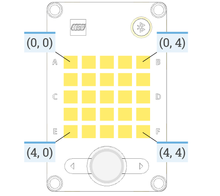

# Light Matrix

!!! learn "On this page we will learn"
    - how to light up single pixels on the light matrix
    - how to show icons, numbers and letters
    - how to scroll text and play animations
    - how to change which way the display faces

!!! terms "Terminology"
    - **light matrix** – the 5×5 grid of lights on the front of the hub that can show pixels, icons, numbers and letters.
    - **brightness** – how strongly a light shines, from `0` (off) to `100` (fully on).
    - **character** – a single letter, digit or symbol.
    - **orientation** – which way something is facing, such as which side of the hub counts as the top of the display.

The light matrix is the 5×5 grid of lights on the front of the hub. We can light up single pixels, show icons, numbers and letters, and scroll text.

Possible uses:

- showing a score, count or sensor reading
- showing which way the robot is about to turn
- giving the robot a face and personality
- menus for choosing a program

## Connect it

The light matrix is built into the hub, so we don't need to connect anything.

- See [Setup](../start/setup.md#create-and-run-a-program) for how to create and run each example.
- Each pixel has a **coordinate** made of its row and column: `(row, column)`. Rows are numbered 0 to 4 from top to bottom, and columns 0 to 4 from left to right.
- **Brightness** goes from `0` (off) to `100` (fully on).



## Set it up

The light matrix is part of the hub. We import the Pybricks commands, then create the hub in the setup. The icon examples also need `Icon`, which is added to the end of line 3:

```python linenums="1"
from pybricks.hubs import PrimeHub
from pybricks.pupdevices import Motor, ColorSensor, UltrasonicSensor, ForceSensor
from pybricks.parameters import Button, Color, Direction, Port, Side, Stop, Icon
from pybricks.robotics import DriveBase
from pybricks.tools import wait, StopWatch

# Setup
hub = PrimeHub()
```

## Methods

| Method | Parameters | Returns | Description |
| --- | --- | --- | --- |
| `hub.display.pixel(row, column, brightness=100)` | `row`, `column`: 0–4; `brightness`: 0–100 | none | Turns on one pixel |
| `hub.display.off()` | none | none | Turns off every pixel |
| `hub.display.icon(icon)` | `icon`: an `Icon` | none | Shows a built-in picture |
| `hub.display.animate(matrices, interval)` | `matrices`: list of `Icon`s; `interval`: ms per icon | none | Plays the icons as an animation, forever, while the program keeps running |
| `hub.display.number(number)` | `number`: −99 to 99 | none | Shows a whole number |
| `hub.display.char(char)` | `char`: one character | none | Shows a single letter, digit or symbol |
| `hub.display.text(text, on=500, off=50)` | `text`: a string; `on`, `off`: ms | none | Shows the text one character at a time |
| `hub.display.orientation(up)` | `up`: `Side.TOP`, `Side.BOTTOM`, `Side.LEFT` or `Side.RIGHT` | none | Sets which side of the hub counts as the top of the display |

### `pixel()`

Turns on one pixel at a chosen row, column and brightness. Other pixels stay as they are.

```python linenums="1"
--8<-- "examples/hub/light_matrix/pixel/main.py"
```

!!! primm "PRIMM"
    1. **Predict** what you think will happen. Be specific.
    2. **Run** the program.
    3. Time to **investigate** the code. What does each line do?

??? note "Code explanation"
    - **lines 1–5** → import the Pybricks commands for the hub, motors, sensors, settings and timing.
    - **line 8** → creates the hub and names it `hub`.
    - **line 11** → starts the main loop, which repeats forever.
    - **line 12** → turns on the pixel in row 2, column 2 (the centre) at full brightness.

### `off()`

Turns off every pixel on the display.

```python linenums="1"
--8<-- "examples/hub/light_matrix/off/main.py"
```

!!! primm "PRIMM"
    1. **Predict** what you think will happen. Be specific.
    2. **Run** the program.
    3. Time to **investigate** the code. What does each line do?

??? note "Code explanation"
    - **lines 1–5** → import the Pybricks commands for the hub, motors, sensors, settings and timing.
    - **line 8** → creates the hub and names it `hub`.
    - **line 11** → starts the main loop, which repeats forever.
    - **line 12** → turns on the centre pixel at full brightness.
    - **line 13** → waits 500 milliseconds.
    - **line 14** → turns off every pixel.
    - **line 15** → waits 500 milliseconds before the loop starts again.

### `icon()`

Shows one of the built-in pictures, such as `Icon.HAPPY`, `Icon.HEART` or `Icon.ARROW_UP`. See the [full icon list](https://docs.pybricks.com/en/stable/parameters/icon.html).

```python linenums="1"
--8<-- "examples/hub/light_matrix/icon/main.py"
```

!!! primm "PRIMM"
    1. **Predict** what you think will happen. Be specific.
    2. **Run** the program.
    3. Time to **investigate** the code. What does each line do?

??? note "Code explanation"
    - **lines 1–5** → import the Pybricks commands for the hub, motors, sensors, settings and timing, including `Icon` at the end of line 3.
    - **line 8** → creates the hub and names it `hub`.
    - **line 11** → starts the main loop, which repeats forever.
    - **line 12** → shows the happy face icon.

### `animate()`

Shows each icon in a list for a set time, then starts the list again. The animation runs in the background, so the rest of the program keeps running.

```python linenums="1"
--8<-- "examples/hub/light_matrix/animate/main.py"
```

!!! primm "PRIMM"
    1. **Predict** what you think will happen. Be specific.
    2. **Run** the program.
    3. Time to **investigate** the code. What does each line do?

??? note "Code explanation"
    - **lines 1–5** → import the Pybricks commands for the hub, motors, sensors, settings and timing, including `Icon` at the end of line 3.
    - **line 8** → creates the hub and names it `hub`.
    - **line 9** → stores a **list** of four arrow icons in `arrows`. A list holds several values in order, inside square brackets.
    - **line 10** → starts the animation, showing each arrow for 500 ms.
    - **line 13** → starts the main loop, which repeats forever.
    - **line 14** → does nothing, but keeps the program running so the animation keeps playing.

### `number()`

Shows a whole number from −99 to 99.

```python linenums="1"
--8<-- "examples/hub/light_matrix/number/main.py"
```

!!! primm "PRIMM"
    1. **Predict** what you think will happen. Be specific.
    2. **Run** the program.
    3. Time to **investigate** the code. What does each line do?

??? note "Code explanation"
    - **lines 1–5** → import the Pybricks commands for the hub, motors, sensors, settings and timing.
    - **line 8** → creates the hub and names it `hub`.
    - **line 9** → creates a **variable** called `count` and sets it to `0`.
    - **line 12** → starts the main loop, which repeats forever.
    - **line 13** → shows the value of `count` on the display.
    - **line 14** → adds 1 to `count`.
    - **line 15** → waits 500 milliseconds before the loop starts again.

### `char()`

Shows a single character: a letter, a digit or a symbol.

```python linenums="1"
--8<-- "examples/hub/light_matrix/char/main.py"
```

!!! primm "PRIMM"
    1. **Predict** what you think will happen. Be specific.
    2. **Run** the program.
    3. Time to **investigate** the code. What does each line do?

??? note "Code explanation"
    - **lines 1–5** → import the Pybricks commands for the hub, motors, sensors, settings and timing.
    - **line 8** → creates the hub and names it `hub`.
    - **line 11** → starts the main loop, which repeats forever.
    - **line 12** → shows the letter `A`.

### `text()`

Shows a **string** (a piece of text) one character at a time. Each character shows for 500 ms with a 50 ms gap, unless we give different `on` and `off` times. The program waits until the whole string has been shown before moving to the next line.

```python linenums="1"
--8<-- "examples/hub/light_matrix/text/main.py"
```

!!! primm "PRIMM"
    1. **Predict** what you think will happen. Be specific.
    2. **Run** the program.
    3. Time to **investigate** the code. What does each line do?

??? note "Code explanation"
    - **lines 1–5** → import the Pybricks commands for the hub, motors, sensors, settings and timing.
    - **line 8** → creates the hub and names it `hub`.
    - **line 11** → starts the main loop, which repeats forever.
    - **line 12** → shows `SPIKE` one letter at a time.
    - **line 13** → waits 1 second before the loop starts again.

### `orientation()`

Sets which side of the hub counts as the top of the display. This is useful when the hub is mounted sideways on a robot. It only affects what is shown after it is called.

```python linenums="1"
--8<-- "examples/hub/light_matrix/orientation/main.py"
```

!!! primm "PRIMM"
    1. **Predict** what you think will happen. Be specific.
    2. **Run** the program.
    3. Time to **investigate** the code. What does each line do?

??? note "Code explanation"
    - **lines 1–5** → import the Pybricks commands for the hub, motors, sensors, settings and timing.
    - **line 8** → creates the hub and names it `hub`.
    - **line 9** → makes the left side of the hub the top of the display.
    - **line 12** → starts the main loop, which repeats forever.
    - **line 13** → shows the letter `A`, which now appears on its side.

## Documentation

Documentation is the official guide written by the people who made the code library, and we can use it to look up every method and its parameters, including ones that aren't covered on this page.

- [Pybricks — Prime Hub display](https://docs.pybricks.com/en/stable/hubs/primehub.html#pybricks.hubs.PrimeHub.display.orientation)
- [Pybricks — Icon](https://docs.pybricks.com/en/stable/parameters/icon.html)

## Exercises

!!! primm "PRIMM"
    Time to **modify** the code and see what happens.

Starter files are in the `light_matrix` folder of your tutorial files. Solutions are on the [Exercise Solutions](../reference/solutions.md#light-matrix) page.

### Exercise 1

Starter: `light_matrix/ex1_my_face`

Can you draw your own face on the display using `pixel()`? It should have two eyes and a smile.

### Exercise 2

Starter: `light_matrix/ex2_countdown`

Can you create a countdown timer? It should:

- count down from 10 to 0, showing each number for 1 second
- show a happy face for 3 seconds when it reaches 0
- start the countdown again

### Exercise 3

Starter: `light_matrix/ex3_name_and_heart`

Can you show your name one letter at a time, then show a heart for 1 second, over and over?

### Exercise 4

Starter: `light_matrix/ex4_past_99`

Run the `number()` example and wait. What happens when `count` goes past 99? Why do you think this happens?
