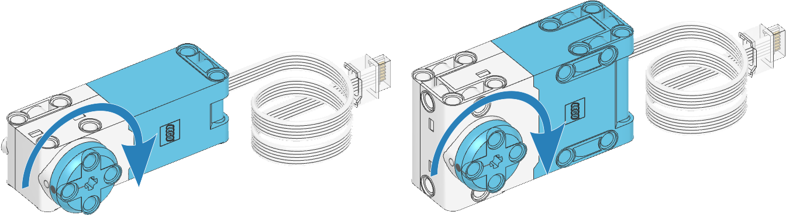

# Motor

!!! learn "On this page we will learn"
    - how to run a motor and stop it in different ways
    - the difference between `stop()`, `brake()` and `hold()`
    - how to run a motor for a set time or angle, or to a target angle

!!! terms "Terminology"
    - **angular motor** – a motor that can turn an exact number of degrees because it has a built-in encoder.
    - **encoder** – a sensor built into a motor that counts how many degrees the motor has turned.
    - **DC motor** – a simple motor without an encoder that can only be turned on and off and have its power set.
    - **object** – a thing in our program, such as a motor or sensor, that we create in the setup and then control with its methods.
    - **port** – the socket on the hub that a motor or sensor is plugged into, such as `Port.E`.
    - **positive direction** – the way a motor turns when we give it a positive speed, either clockwise or anticlockwise.
    - **duty cycle** – the percentage of full power sent to a motor, without the motor trying to keep a constant speed.
    - **coasting** – cutting the power to a motor and letting it spin freely until friction stops it.
    - **target angle** – the exact position a motor turns to, measured from where it was when the program started.

Our robot has two SPIKE Medium Angular Motors, one for each wheel. We can control each motor on its own: run it forever, stop it in different ways, or move it for a set time or angle.

Possible uses:

- driving a wheel
- lifting an arm or opening a gripper
- spinning a flag, fan or turntable
- pointing a sensor in a different direction

## Connect it

- See [Setup](../start/setup.md#create-and-run-a-program) for how to create and run each example.
- The left motor is in **Port E** and the right motor is in **Port F**. See [Setup](../start/setup.md#check-the-robot-configuration) to check.
- The SPIKE Prime kit has two motor sizes: the **Medium Angular Motor** and the **Large Angular Motor**. Both use the same code. The large motor is more powerful.
- **Speed** is measured in degrees per second (deg/s). One full turn is 360°.
- **Angle** is measured in degrees.



!!! tip "Angular motors and DC motors"
    The SPIKE Prime motors are called **angular motors** because they can turn an exact number of degrees. They can do this because they have a built-in sensor called an **encoder**, which counts how many degrees the motor has turned.

    Motors without encoders are called **DC motors**. We can only turn them on and off, and set their power.

!!! warning "Lift the robot off the desk"
    These examples only move one wheel, so the robot will spin in circles. Lift the robot or rest it on something so its wheels don't touch the desk.

## Set it up

We create a `Motor` object for each motor we want to use. It needs two things:

- the **port** the motor is plugged into, such as `Port.E`
- the **positive direction**: which way the motor turns when we give it a positive speed. This is `Direction.CLOCKWISE` or `Direction.COUNTERCLOCKWISE`.

The motors face opposite ways on our robot, so the left motor needs to turn anticlockwise and the right motor clockwise for both wheels to drive forwards:

```python linenums="1"
from pybricks.hubs import PrimeHub
from pybricks.pupdevices import Motor, ColorSensor, UltrasonicSensor, ForceSensor
from pybricks.parameters import Button, Color, Direction, Port, Side, Stop
from pybricks.robotics import DriveBase
from pybricks.tools import wait, StopWatch

# Setup
hub = PrimeHub()
left_motor = Motor(Port.E, Direction.COUNTERCLOCKWISE)
right_motor = Motor(Port.F, Direction.CLOCKWISE)
```

The examples below only use the left motor.

## Methods

| Method | Parameters | Returns | Description |
| --- | --- | --- | --- |
| `run(speed)` | `speed`: deg/s | none | Runs the motor at a constant speed, forever |
| `dc(duty)` | `duty`: −100 to 100 % | none | Runs the motor at a percentage of full power, forever |
| `stop()` | none | none | Stops the motor and lets it spin freely |
| `brake()` | none | none | Stops the motor with a gentle brake |
| `hold()` | none | none | Stops the motor and holds it still at its current angle |
| `run_time(speed, time, then=Stop.HOLD, wait=True)` | `speed`: deg/s; `time`: ms | none | Runs the motor for a set time |
| `run_angle(speed, rotation_angle, then=Stop.HOLD, wait=True)` | `speed`: deg/s; `rotation_angle`: degrees | none | Turns the motor by a set number of degrees |
| `run_target(speed, target_angle, then=Stop.HOLD, wait=True)` | `speed`: deg/s; `target_angle`: degrees | none | Turns the motor to a set angle |
| `track_target(target_angle)` | `target_angle`: degrees | none | Turns the motor to a set angle as fast as possible |

### `run()`

Runs the motor at a constant speed until we tell it to do something else. A negative speed runs it backwards.

```python linenums="1"
--8<-- "examples/motors/motor/run/main.py"
```

!!! primm "PRIMM"
    1. **Predict** what you think will happen. Be specific.
    2. **Run** the program.
    3. Time to **investigate** the code. What does each line do?

??? note "Code explanation"
    - **lines 1–5** → import the Pybricks commands for the hub, motors, sensors, settings and timing.
    - **line 8** → creates the hub and names it `hub`.
    - **line 9** → creates the left motor in Port E, with anticlockwise as its positive direction.
    - **line 12** → starts the main loop, which repeats forever.
    - **line 13** → runs the left motor at 500 degrees per second.

### `dc()`

Runs the motor at a percentage of its full power. This is called the **duty cycle**. Unlike `run()`, the motor doesn't try to keep a constant speed, so it slows down if something pushes against it.

```python linenums="1"
--8<-- "examples/motors/motor/dc/main.py"
```

!!! primm "PRIMM"
    1. **Predict** what you think will happen. Be specific.
    2. **Run** the program. Gently slow the wheel with your finger.
    3. Time to **investigate** the code. What does each line do?

??? note "Code explanation"
    - **lines 1–5** → import the Pybricks commands for the hub, motors, sensors, settings and timing.
    - **line 8** → creates the hub and names it `hub`.
    - **line 9** → creates the left motor in Port E, with anticlockwise as its positive direction.
    - **line 12** → starts the main loop, which repeats forever.
    - **line 13** → runs the left motor at 50% power.

### `stop()`

Cuts the power to the motor and lets it spin freely until friction stops it. This is called **coasting**.

```python linenums="1"
--8<-- "examples/motors/motor/stop/main.py"
```

!!! primm "PRIMM"
    1. **Predict** what you think will happen. Be specific.
    2. **Run** the program. When the wheel stops, try turning it with your fingers.
    3. Time to **investigate** the code. What does each line do?

??? note "Code explanation"
    - **lines 1–5** → import the Pybricks commands for the hub, motors, sensors, settings and timing.
    - **line 8** → creates the hub and names it `hub`.
    - **line 9** → creates the left motor in Port E, with anticlockwise as its positive direction.
    - **line 12** → starts the main loop, which repeats forever.
    - **line 13** → runs the left motor at 500 degrees per second.
    - **line 14** → waits 1 second while the motor runs.
    - **line 15** → stops the motor and lets it spin freely.
    - **line 16** → waits 1 second before the loop starts again.

### `brake()`

Stops the motor with a gentle brake, so it stops faster than `stop()`.

```python linenums="1"
--8<-- "examples/motors/motor/brake/main.py"
```

!!! primm "PRIMM"
    1. **Predict** what you think will happen. Be specific.
    2. **Run** the program. When the wheel stops, try turning it with your fingers.
    3. Time to **investigate** the code. What does each line do?

??? note "Code explanation"
    - **lines 1–5** → import the Pybricks commands for the hub, motors, sensors, settings and timing.
    - **line 8** → creates the hub and names it `hub`.
    - **line 9** → creates the left motor in Port E, with anticlockwise as its positive direction.
    - **line 12** → starts the main loop, which repeats forever.
    - **line 13** → runs the left motor at 500 degrees per second.
    - **line 14** → waits 1 second while the motor runs.
    - **line 15** → brakes the motor.
    - **line 16** → waits 1 second before the loop starts again.

### `hold()`

Stops the motor and then actively holds it at that angle. If we push the wheel, the motor pushes back.

```python linenums="1"
--8<-- "examples/motors/motor/hold/main.py"
```

!!! primm "PRIMM"
    1. **Predict** what you think will happen. Be specific.
    2. **Run** the program. When the wheel stops, try turning it with your fingers.
    3. Time to **investigate** the code. What does each line do?

??? note "Code explanation"
    - **lines 1–5** → import the Pybricks commands for the hub, motors, sensors, settings and timing.
    - **line 8** → creates the hub and names it `hub`.
    - **line 9** → creates the left motor in Port E, with anticlockwise as its positive direction.
    - **line 12** → starts the main loop, which repeats forever.
    - **line 13** → runs the left motor at 500 degrees per second.
    - **line 14** → waits 1 second while the motor runs.
    - **line 15** → stops the motor and holds it at its current angle.
    - **line 16** → waits 1 second before the loop starts again.

!!! tip "`stop()`, `brake()` or `hold()`?"
    - `stop()` → the motor coasts to a stop. Use it for a smooth finish.
    - `brake()` → the motor stops sooner. Use it to stop quickly without holding.
    - `hold()` → the motor stops sharply and stays locked in place. Use it for arms and grippers that must not move.

### `run_time()`

Runs the motor at a set speed for a set time in milliseconds, then stops.

```python linenums="1"
--8<-- "examples/motors/motor/run_time/main.py"
```

!!! primm "PRIMM"
    1. **Predict** what you think will happen. Be specific.
    2. **Run** the program.
    3. Time to **investigate** the code. What does each line do?

??? note "Code explanation"
    - **lines 1–5** → import the Pybricks commands for the hub, motors, sensors, settings and timing.
    - **line 8** → creates the hub and names it `hub`.
    - **line 9** → creates the left motor in Port E, with anticlockwise as its positive direction.
    - **line 12** → starts the main loop, which repeats forever.
    - **line 13** → runs the left motor at 500 degrees per second for 2000 ms (2 seconds), then holds it still.
    - **line 14** → waits 1 second before the loop starts again.

### `run_angle()`

Turns the motor by a set number of degrees from wherever it is now, then stops.

```python linenums="1"
--8<-- "examples/motors/motor/run_angle/main.py"
```

!!! primm "PRIMM"
    1. **Predict** what you think will happen. Be specific.
    2. **Run** the program.
    3. Time to **investigate** the code. What does each line do?

??? note "Code explanation"
    - **lines 1–5** → import the Pybricks commands for the hub, motors, sensors, settings and timing.
    - **line 8** → creates the hub and names it `hub`.
    - **line 9** → creates the left motor in Port E, with anticlockwise as its positive direction.
    - **line 12** → starts the main loop, which repeats forever.
    - **line 13** → turns the left motor 90° at 500 degrees per second, then holds it still.
    - **line 14** → waits 1 second before the loop starts again.

### `run_target()`

Turns the motor to a set **target angle**. The motor remembers its angle from when the program started, so `run_target(500, 180)` always ends in the same position, no matter where the motor started from.

```python linenums="1"
--8<-- "examples/motors/motor/run_target/main.py"
```

!!! primm "PRIMM"
    1. **Predict** what you think will happen. Be specific.
    2. **Run** the program.
    3. Time to **investigate** the code. What does each line do?

??? note "Code explanation"
    - **lines 1–5** → import the Pybricks commands for the hub, motors, sensors, settings and timing.
    - **line 8** → creates the hub and names it `hub`.
    - **line 9** → creates the left motor in Port E, with anticlockwise as its positive direction.
    - **line 12** → starts the main loop, which repeats forever.
    - **line 13** → turns the left motor to the 0° position at 500 degrees per second.
    - **line 14** → waits 1 second.
    - **line 15** → turns the left motor to the 180° position at 500 degrees per second.
    - **line 16** → waits 1 second before the loop starts again.

### `track_target()`

Turns the motor to a target angle as fast as it can, without speeding up and slowing down smoothly like `run_target()` does. It is useful when the target keeps changing, such as a pointer that follows a sensor reading.

```python linenums="1"
--8<-- "examples/motors/motor/track_target/main.py"
```

!!! primm "PRIMM"
    1. **Predict** what you think will happen. Be specific.
    2. **Run** the program. Compare it with the `run_target()` example.
    3. Time to **investigate** the code. What does each line do?

??? note "Code explanation"
    - **lines 1–5** → import the Pybricks commands for the hub, motors, sensors, settings and timing.
    - **line 8** → creates the hub and names it `hub`.
    - **line 9** → creates the left motor in Port E, with anticlockwise as its positive direction.
    - **line 12** → starts the main loop, which repeats forever.
    - **line 13** → moves the left motor to the 0° position as fast as possible.
    - **line 14** → waits 1 second.
    - **line 15** → moves the left motor to the 180° position as fast as possible.
    - **line 16** → waits 1 second before the loop starts again.

!!! tip "`run_angle()`, `run_target()` or `track_target()`?"
    - `run_angle()` → turn **by** an amount, such as "turn another 90°".
    - `run_target()` → turn **to** a position, such as "point the arm straight up".
    - `track_target()` → keep following a position that changes all the time.

!!! tip "Waiting for the motor"
    `run_time()`, `run_angle()` and `run_target()` have a `wait` parameter. It is `True` unless we change it, which means the program waits for the motor to finish before running the next line. To start two motors at the same time, we give the first one `wait=False`:

    ```python
    left_motor.run_angle(500, 360, wait=False)
    right_motor.run_angle(500, 360)
    ```

    The `then` parameter chooses how the motor stops at the end: `Stop.HOLD` (the default), `Stop.BRAKE` or `Stop.COAST`.

## Documentation

Documentation is the official guide written by the people who made the code library, and we can use it to look up every method and its parameters, including ones that aren't covered on this page.

- [Pybricks — Motors with rotation sensors](https://docs.pybricks.com/en/stable/pupdevices/motor.html)

## Exercises

!!! primm "PRIMM"
    Time to **modify** the code and see what happens.

Starter files are in the `motor` folder of your tutorial files. Solutions are on the [Exercise Solutions](../reference/solutions.md#motor) page.

### Exercise 1

Starter: `motor/ex1_stopping_test`

Can you create a program that compares the three ways of stopping? It should:

- run the left motor at full power for 1 second, then `stop()` it, with the status light green
- run it again, then `brake()` it, with the status light orange
- run it again, then `hold()` it, with the status light red
- wait 1 second after each stop, and repeat

### Exercise 2

Starter: `motor/ex2_both_wheels`

Can you make both wheels turn forwards for 2 seconds **at the same time**, then wait 1 second, over and over?

### Exercise 3

Starter: `motor/ex3_no_wait`

Run the program. Do the wheels turn at the same time or one after the other? Why do you think this happens?

### Exercise 4

Starter: `motor/ex4_clock_hand`

Can you make the left wheel tick like the second hand of a clock? It should turn 6° every second, so it makes one full turn every minute.
