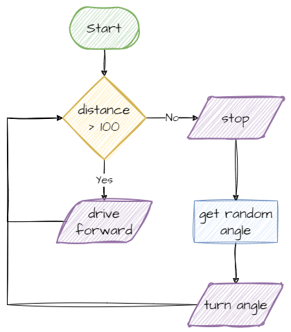

# Developing Robot Code

Before we write code for a robot project, we plan it. In this project we'll plan and build a robot that drives around the room at random without running into anything, using four planning steps: requirements, an IPO table, a flowchart and pseudocode.

!!! tip "Scenario"
    Make your robot move randomly around the room while avoiding running into anything.

## What you need

- the robot, with the distance sensor in **Port C**
- a clear floor space with a few obstacles, such as boxes or books
- these pages: [Program Structure](../start/program-structure.md), [Driving](../drivebase/driving.md) and [Distance Sensor](../sensors/distance.md)

## Plan

### Step 1: Identify the requirements

**Requirements** are everything the robot needs to do. They need to be specific. Instead of "the robot drives", we say for how long, or until what happens.

For our scenario, the robot needs to:

1. drive forwards, and keep driving
2. stop when it detects an object within 10 cm (100 mm)
3. turn in a random direction
4. go back to requirement 1

### Step 2: Create an IPO table

Every digital system has three parts:

- **Input** → information the system gets from the real world, such as a sensor reading
- **Process** → the decisions and calculations the system makes with that input
- **Output** → what the system does in the real world, such as moving a motor

An **IPO table** maps these out. We build it in three passes.

First, our requirements are what the robot does, so they become the **outputs**:

| Input | Process | Output |
| --- | --- | --- |
| | | Drive forwards, and keep driving |
| | | Stop |
| | | Turn in a random direction |

Next, we work out which **input** tells the robot when to do each output:

| Input | Process | Output |
| --- | --- | --- |
| No object within 100 mm | | Drive forwards, and keep driving |
| Object within 100 mm | | Stop |
| Robot has stopped | | Turn in a random direction |

Finally, we fill in the **process**: how the robot turns each input into its output. We name the robot parts that do the work:

| Input | Process | Output |
| --- | --- | --- |
| No object within 100 mm | If the distance sensor reads more than 100, the drive base drives forwards | Drive forwards, and keep driving |
| Object within 100 mm | If the distance sensor reads 100 or less, the drive base stops | Stop |
| Robot has stopped | Pick a random angle, and the drive base turns by that angle | Turn in a random direction |

### Step 3: Draw a flowchart

A **flowchart** shows the steps of the process and the order they happen in. See [Flowcharts](flowcharts.md) for what each symbol means.



### Step 4: Write pseudocode

**Pseudocode** is a plan for our code, written in plain words. It shows the steps of the **algorithm** (the step-by-step method for solving the problem) without worrying about Python's rules. The only test is that each line is clear.

```text
start main loop
    distance = read distance sensor
    if distance > 100
        drive robot forwards
    else
        stop robot
        angle = random number from -180 to 180
        turn robot by angle
```

Our pseudocode uses some programming words and indentation, but it doesn't have to. Any clear set of steps works.

## Build it

We build the program in small steps and test each one before moving on. That way, if something goes wrong, we know it's in the part we just added.

### Step 1: Set up the robot

Create a new file called `move_and_avoid.py`. We start with the imports and the setup: the hub, both motors, the drive base and the distance sensor. The main loop does nothing yet.

```python linenums="1"
--8<-- "examples/planning/developing_code/step1_setup/main.py"
```

??? note "Code explanation"
    - **lines 1–5** → import the Pybricks commands for the hub, motors, sensors, settings and timing.
    - **line 6** → imports `randint`, which picks a random whole number.
    - **line 9** → creates the hub and names it `hub`.
    - **line 10** → creates the left motor in Port E, with anticlockwise as its positive direction.
    - **line 11** → creates the right motor in Port F, with clockwise as its positive direction.
    - **line 12** → joins the two motors into a drive base called `my_robot`.
    - **line 13** → creates the distance sensor in Port C and names it `distance_sensor`.
    - **line 16** → starts the main loop, which repeats forever.
    - **line 17** → does nothing yet. `pass` is a placeholder so the loop isn't empty.

Run it. The robot should do nothing, and there should be no errors in the terminal.

### Step 2: Drive and stop

Now we replace `pass` with the first two rows of our IPO table: read the distance, then drive or stop.

```python linenums="1"
--8<-- "examples/planning/developing_code/step2_drive_and_stop/main.py"
```

??? note "Code explanation"
    - **lines 1–5** → import the Pybricks commands for the hub, motors, sensors, settings and timing.
    - **line 6** → imports `randint`, which picks a random whole number.
    - **line 9** → creates the hub and names it `hub`.
    - **line 10** → creates the left motor in Port E, with anticlockwise as its positive direction.
    - **line 11** → creates the right motor in Port F, with clockwise as its positive direction.
    - **line 12** → joins the two motors into a drive base called `my_robot`.
    - **line 13** → creates the distance sensor in Port C and names it `distance_sensor`.
    - **line 16** → starts the main loop, which repeats forever.
    - **line 18** → reads the distance to the nearest object and stores it in `distance`.
    - **line 21** → checks if the nearest object is more than 100 mm away…
    - **line 22** → …if it is, drives forwards at 200 mm per second.
    - **line 23** → if it isn't…
    - **line 24** → …stops the robot.

Run it and put your hand in front of the robot. It should drive forwards and stop when your hand is closer than 10 cm, then drive on again when you move your hand away.

### Step 3: Turn in a random direction

Finally, we add the last row of the IPO table. After stopping, the robot picks a random angle and turns.

```python linenums="1"
--8<-- "examples/planning/developing_code/step3_random_turn/main.py"
```

??? note "Code explanation"
    - **lines 1–5** → import the Pybricks commands for the hub, motors, sensors, settings and timing.
    - **line 6** → imports `randint`, which picks a random whole number.
    - **line 9** → creates the hub and names it `hub`.
    - **line 10** → creates the left motor in Port E, with anticlockwise as its positive direction.
    - **line 11** → creates the right motor in Port F, with clockwise as its positive direction.
    - **line 12** → joins the two motors into a drive base called `my_robot`.
    - **line 13** → creates the distance sensor in Port C and names it `distance_sensor`.
    - **line 16** → starts the main loop, which repeats forever.
    - **line 18** → reads the distance to the nearest object and stores it in `distance`.
    - **line 21** → checks if the nearest object is more than 100 mm away…
    - **line 22** → …if it is, drives forwards at 200 mm per second.
    - **line 23** → if it isn't…
    - **line 24** → …stops the robot…
    - **line 25** → …picks a random whole number from −180 to 180 and stores it in `angle`…
    - **line 26** → …and turns the robot by that angle.

## Test it

Put the robot in a space with some obstacles and run the program. Check that:

- the robot drives forwards when nothing is in front of it
- it stops before it touches an obstacle
- it turns a different amount each time
- after turning, it drives off again

If the robot hits something, look back at the distance sensor's [limits](../sensors/distance.md#connect-it). Is the obstacle soft, thin or at an angle?

## Extend it

- Can you make the status light green while the robot drives and red while it turns?
- Can you make the robot beep each time it finds an obstacle?
- Can you make the robot turn only left or only right, but by a random amount?
- Can you make the robot count the obstacles it has found and show the count on the display?
- Can you use the force sensor as a bumper, so the robot also turns when it bumps into something the distance sensor missed?

For each one, update your IPO table and pseudocode first, then change the code.
