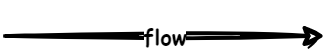
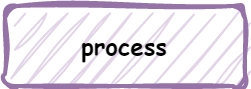
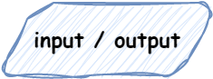
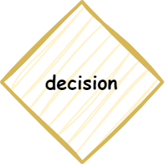
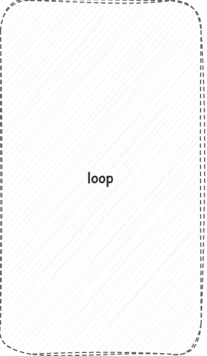
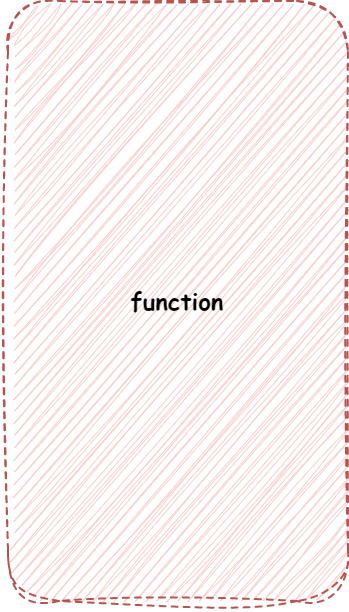
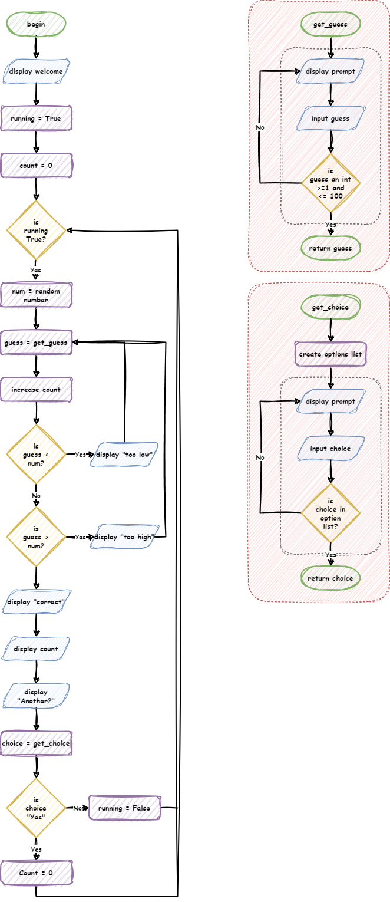

# Flowcharts

!!! learn "On this page we will learn"
    - what a flowchart is and why we use one
    - what each flowchart symbol means
    - the rules for arrows going in and out of each symbol
    - how to read a complete flowchart

A **flowchart** is a diagram that uses shapes and arrows to show the steps in a process. In programming, we use flowcharts to plan **algorithms**, the step-by-step methods our programs follow.

## Symbols

Each shape in a flowchart has a meaning. The arrows joining them have rules about how many can go in (**inflows**) and how many can come out (**outflows**).

### Flow arrows

Flow arrows show the path the program takes through the flowchart. A flow only goes one way, in the direction of the arrowhead.

### Terminal blocks

Terminal blocks start and end a process. They are rounded rectangles. For a main program they contain "Start" or "End". For a function, they contain the function's name or the value it returns.

| Block | Inflows | Outflows |
| --- | --- | --- |
| Start | none | exactly one |
| End | exactly one | none |

### Process blocks

Process blocks show the steps that happen inside the program, such as:

- storing a value in a variable
- doing a calculation
- calling a function

They are rectangles with a description inside.

| Inflows | Outflows |
| --- | --- |
| at least one | exactly one |

### Input/output blocks

Input/output (IO) blocks show information moving between the program and the real world. They are parallelograms, with text saying what goes in or comes out.

**Input** is information coming into the program, such as:

- a sensor reading
- a button press
- typing on a keyboard

**Output** is the program acting on the real world, such as:

- moving a motor
- showing an image or text on a screen
- playing a sound

| Inflows | Outflows |
| --- | --- |
| at least one | exactly one |

### Decision blocks

Decision blocks ask a question and split the flow depending on the answer. They are diamonds with the question inside.

Decision blocks are the only blocks that can have more than one outflow. Label each outflow with the answer that leads down that path, such as "Yes" and "No".

| Inflows | Outflows |
| --- | --- |
| exactly one | two or more |

## Extra symbols

The flowcharts in these tutorials use two extra symbols to make them easier to read. We don't have to use them, but we can if they help.

### Loop indicator

The loop indicator is a grey box with dashed lines. It surrounds a loop, and starts or ends with the decision block that checks the loop's condition.

### Function indicator

The function indicator is a red box with dashed lines. It surrounds a function, with the function's start terminal at the top and its end terminal at the bottom. No flow arrows go into or out of the function indicator.

## Example

This flowchart is for a number guessing game. The game needs to:

- generate a random number from 1 to 100
- ask the player to guess the number
- tell the player if their guess is too high or too low
- tell the player how many guesses they took when they get it right
- only accept whole numbers from 1 to 100
- ask the player if they want to play again

!!! tip "Check your flowchart"
    Before writing code, trace through the flowchart with your finger, using some test values. Check that every path reaches the end or loops back, and that every block follows the inflow and outflow rules.
