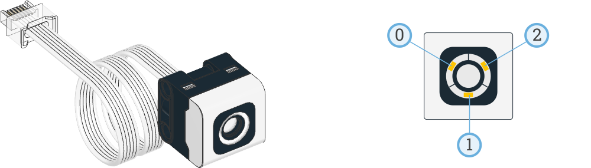

# Colour Sensor

!!! learn "On this page we will learn"
    - how to detect the colour of a surface
    - how to measure reflected light and room brightness
    - how to choose which colours the sensor looks for
    - how to turn the sensor's lights on and off

!!! terms "Terminology"
    - **colour sensor** – a sensor that detects the colour of a surface, how much light it reflects and how bright the room is.
    - **reflected light** – the amount of the sensor's own light that bounces back from a surface, from 0% (black) to 100% (white).

The colour sensor detects the colour of a surface, how much light a surface reflects, and how bright the room is. It has its own lights, so it can light up a surface to measure it.

Possible uses:

- following a black line on a white mat
- sorting LEGO bricks by colour
- stopping at a coloured marker
- detecting whether it is light or dark



## Connect it

- See [Setup](../start/setup.md#create-and-run-a-program) for how to create and run each example.
- The colour sensor is in **Port D**.
- For surface readings, hold the sensor about 1 cm from the surface, pointing straight at it.
- The sensor has three ways of measuring:
    - **Colour** → which colour it sees, such as `Color.RED`. By default it recognises red, yellow, green, blue and white, or `Color.NONE` if it sees nothing it recognises.
    - **Reflected light** → shines its own light on a surface and measures how much bounces back, from 0% (black) to 100% (white).
    - **Ambient light** → measures the light around it without using its own lights, from 0% (dark) to 100% (bright).

## Set it up

We create a `ColorSensor` object and tell it which port the sensor is in:

```python linenums="1"
from pybricks.hubs import PrimeHub
from pybricks.pupdevices import Motor, ColorSensor, UltrasonicSensor, ForceSensor
from pybricks.parameters import Button, Color, Direction, Port, Side, Stop
from pybricks.robotics import DriveBase
from pybricks.tools import wait, StopWatch

# Setup
hub = PrimeHub()
colour_sensor = ColorSensor(Port.D)
```

Pybricks uses the American spelling `ColorSensor` and `color()`, but we name our object `colour_sensor`.

## Methods

| Method | Parameters | Returns | Description |
| --- | --- | --- | --- |
| `color(surface=True)` | `surface`: `True` for surfaces, `False` for screens and lights | `Color` | The colour the sensor sees |
| `reflection()` | none | int (%) | How much of the sensor's light bounces back |
| `ambient()` | none | int (%) | How bright the light around the sensor is |
| `detectable_colors(colors)` | `colors`: list of `Color`s | none | Sets which colours `color()` can return |
| `lights.on(brightness)` | `brightness`: 0–100 % | none | Turns on the sensor's lights |
| `lights.off()` | none | none | Turns off the sensor's lights |

### `color()`

Returns the colour the sensor sees, such as `Color.RED` or `Color.NONE`. To measure a screen or a light instead of a surface, use `color(False)`.

```python linenums="1"
--8<-- "examples/sensors/colour/color/main.py"
```

!!! primm "PRIMM"
    1. **Predict** what you think will happen. Be specific.
    2. **Run** the program. Hold different coloured LEGO bricks in front of the sensor.
    3. Time to **investigate** the code. What does each line do?

??? note "Code explanation"
    - **lines 1–5** → import the Pybricks commands for the hub, motors, sensors, settings and timing.
    - **line 8** → creates the hub and names it `hub`.
    - **line 9** → creates the colour sensor in Port D and names it `colour_sensor`.
    - **line 12** → starts the main loop, which repeats forever.
    - **line 13** → prints the colour the sensor sees.
    - **line 14** → waits 200 milliseconds so the terminal isn't flooded with readings.

### `reflection()`

Shines the sensor's light on a surface and returns how much bounces back, as a percentage. Dark surfaces reflect less light than pale ones.

```python linenums="1"
--8<-- "examples/sensors/colour/reflection/main.py"
```

!!! primm "PRIMM"
    1. **Predict** what you think will happen. Be specific.
    2. **Run** the program. Hold the sensor over black, white and grey surfaces.
    3. Time to **investigate** the code. What does each line do?

??? note "Code explanation"
    - **lines 1–5** → import the Pybricks commands for the hub, motors, sensors, settings and timing.
    - **line 8** → creates the hub and names it `hub`.
    - **line 9** → creates the colour sensor in Port D and names it `colour_sensor`.
    - **line 12** → starts the main loop, which repeats forever.
    - **line 13** → prints the reflected light as a percentage.
    - **line 14** → waits 200 milliseconds before the next reading.

### `ambient()`

Returns how bright the light around the sensor is, as a percentage. The sensor's own lights are turned off for this measurement.

```python linenums="1"
--8<-- "examples/sensors/colour/ambient/main.py"
```

!!! primm "PRIMM"
    1. **Predict** what you think will happen. Be specific.
    2. **Run** the program. Point the sensor at a window, then cover it with your hand.
    3. Time to **investigate** the code. What does each line do?

??? note "Code explanation"
    - **lines 1–5** → import the Pybricks commands for the hub, motors, sensors, settings and timing.
    - **line 8** → creates the hub and names it `hub`.
    - **line 9** → creates the colour sensor in Port D and names it `colour_sensor`.
    - **line 12** → starts the main loop, which repeats forever.
    - **line 13** → prints the ambient light as a percentage.
    - **line 14** → waits 200 milliseconds before the next reading.

### `detectable_colors()`

Sets which colours `color()` is allowed to return. The sensor picks whichever colour in the list is closest to what it sees. Fewer colours means fewer mistakes, because the sensor has fewer colours to mix up.

```python linenums="1"
--8<-- "examples/sensors/colour/detectable_colors/main.py"
```

!!! primm "PRIMM"
    1. **Predict** what the sensor will report for a yellow or green brick. Be specific.
    2. **Run** the program. Hold different coloured bricks in front of the sensor.
    3. Time to **investigate** the code. What does each line do?

??? note "Code explanation"
    - **lines 1–5** → import the Pybricks commands for the hub, motors, sensors, settings and timing.
    - **line 8** → creates the hub and names it `hub`.
    - **line 9** → creates the colour sensor in Port D and names it `colour_sensor`.
    - **line 10** → tells the sensor to only report red, blue or no colour.
    - **line 13** → starts the main loop, which repeats forever.
    - **line 14** → prints the colour the sensor sees, which is now always red, blue or none.
    - **line 15** → waits 200 milliseconds before the next reading.

### `lights.on()`

Turns on the sensor's three lights at a set brightness. We can use them as a torch or an indicator.

```python linenums="1"
--8<-- "examples/sensors/colour/lights_on/main.py"
```

!!! primm "PRIMM"
    1. **Predict** what you think will happen. Be specific.
    2. **Run** the program.
    3. Time to **investigate** the code. What does each line do?

??? note "Code explanation"
    - **lines 1–5** → import the Pybricks commands for the hub, motors, sensors, settings and timing.
    - **line 8** → creates the hub and names it `hub`.
    - **line 9** → creates the colour sensor in Port D and names it `colour_sensor`.
    - **line 12** → starts the main loop, which repeats forever.
    - **line 13** → turns on all three of the sensor's lights at 50% brightness.

### `lights.off()`

Turns off the sensor's lights.

```python linenums="1"
--8<-- "examples/sensors/colour/lights_off/main.py"
```

!!! primm "PRIMM"
    1. **Predict** what you think will happen. Be specific.
    2. **Run** the program.
    3. Time to **investigate** the code. What does each line do?

??? note "Code explanation"
    - **lines 1–5** → import the Pybricks commands for the hub, motors, sensors, settings and timing.
    - **line 8** → creates the hub and names it `hub`.
    - **line 9** → creates the colour sensor in Port D and names it `colour_sensor`.
    - **line 12** → starts the main loop, which repeats forever.
    - **line 13** → turns on the sensor's lights at full brightness.
    - **line 14** → waits 500 milliseconds.
    - **line 15** → turns off the sensor's lights.
    - **line 16** → waits 500 milliseconds before the loop starts again.

!!! tip "The lights and measurements"
    `color()` and `reflection()` turn the lights on by themselves, and `ambient()` turns them off, so we don't need `lights.on()` or `lights.off()` to take measurements.

## Documentation

Documentation is the official guide written by the people who made the code library, and we can use it to look up every method and its parameters, including ones that aren't covered on this page.

- [Pybricks — Color sensor](https://docs.pybricks.com/en/stable/pupdevices/colorsensor.html)

## Exercises

!!! primm "PRIMM"
    Time to **modify** the code and see what happens.

Starter files are in the `colour` folder of your tutorial files. Solutions are on the [Exercise Solutions](../reference/solutions.md#colour-sensor) page.

### Exercise 1

Starter: `colour/ex1_colour_match`

Can you make the hub's status light show the same colour that the colour sensor sees? When the sensor sees no colour, the status light should be off.

### Exercise 2

Starter: `colour/ex2_night_light`

Can you turn the robot into a night light? The status light should turn white when the room is dark and turn off when it is light.

### Exercise 3

Starter: `colour/ex3_stop_on_line`

Can you make the robot drive forwards and stop when the colour sensor is over a black line? Use `reflection()`, and test your mat first to choose a good threshold.
