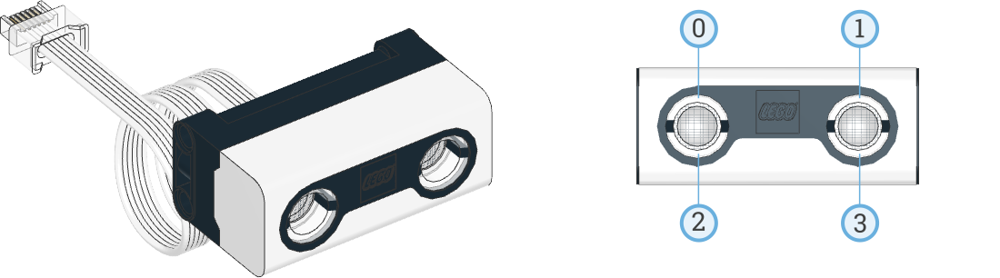

# Distance Sensor

!!! learn "On this page we will learn"
    - how the distance sensor uses ultrasound
    - how to measure the distance to an object
    - how to detect other ultrasonic sensors nearby
    - how to turn the sensor's lights on and off

!!! terms "Terminology"
    - **ultrasound** – sound that is too high-pitched for people to hear.
    - **echo** – a sound wave that bounces back off an object.

The distance sensor measures how far away an object is using **ultrasound**, sound too high-pitched for people to hear. It sends out a sound wave from one "eye", listens for the echo with the other, and uses the time the echo takes to work out the distance. The four lights around its eyes can also be turned on.

Possible uses:

- stopping before the robot hits a wall
- following a wall or another robot
- detecting when someone walks past
- a parking sensor that beeps faster as something gets closer



## Connect it

- See [Setup](../start/setup.md#create-and-run-a-program) for how to create and run each example.
- The distance sensor is in **Port C**.
- **Distance** is measured in millimetres.
- If the sensor can't measure a distance, it returns `2000`.

!!! warning "The sensor's limits"
    The distance sensor isn't perfect. Readings can be wrong when:

    - the object is very close to the sensor (a few centimetres or less)
    - the object is too far away, about 2 metres or more
    - the object is soft, such as a jumper or curtain, because soft things absorb sound
    - the object is at an angle, because the echo bounces away from the sensor
    - the object is small or thin, such as a chair leg

    Test the sensor with the objects the robot will meet before relying on it.

## Set it up

We create an `UltrasonicSensor` object and tell it which port the sensor is in:

```python linenums="1"
from pybricks.hubs import PrimeHub
from pybricks.pupdevices import Motor, ColorSensor, UltrasonicSensor, ForceSensor
from pybricks.parameters import Button, Color, Direction, Port, Side, Stop
from pybricks.robotics import DriveBase
from pybricks.tools import wait, StopWatch

# Setup
hub = PrimeHub()
distance_sensor = UltrasonicSensor(Port.C)
```

## Methods

| Method | Parameters | Returns | Description |
| --- | --- | --- | --- |
| `distance()` | none | int (mm) | How far away the nearest object is |
| `presence()` | none | Boolean | `True` if it hears another ultrasonic sensor nearby |
| `lights.on(brightness)` | `brightness`: 0–100 %, or a list of four values | none | Turns on the lights around the eyes |
| `lights.off()` | none | none | Turns off the lights |

### `distance()`

Returns the distance to the nearest object in front of the sensor, in millimetres.

```python linenums="1"
--8<-- "examples/sensors/distance/distance/main.py"
```

!!! primm "PRIMM"
    1. **Predict** what you think will happen. Be specific.
    2. **Run** the program. Move your hand slowly towards the sensor and away from it.
    3. Time to **investigate** the code. What does each line do?

??? note "Code explanation"
    - **lines 1–5** → import the Pybricks commands for the hub, motors, sensors, settings and timing.
    - **line 8** → creates the hub and names it `hub`.
    - **line 9** → creates the distance sensor in Port C and names it `distance_sensor`.
    - **line 12** → starts the main loop, which repeats forever.
    - **line 13** → prints the distance to the nearest object in millimetres.
    - **line 14** → waits 200 milliseconds so the terminal isn't flooded with readings.

### `presence()`

Listens for the sound of **other** ultrasonic sensors and returns `True` if it hears one. It doesn't measure distance.

```python linenums="1"
--8<-- "examples/sensors/distance/presence/main.py"
```

!!! primm "PRIMM"
    1. **Predict** what you think will happen. Be specific.
    2. **Run** the program. Ask a classmate to point their robot's distance sensor at yours while their program is measuring distance.
    3. Time to **investigate** the code. What does each line do?

??? note "Code explanation"
    - **lines 1–5** → import the Pybricks commands for the hub, motors, sensors, settings and timing.
    - **line 8** → creates the hub and names it `hub`.
    - **line 9** → creates the distance sensor in Port C and names it `distance_sensor`.
    - **line 12** → starts the main loop, which repeats forever.
    - **line 13** → prints `True` if another ultrasonic sensor is heard, or `False` if not.
    - **line 14** → waits 200 milliseconds before the next reading.

### `lights.on()`

Turns on the four lights around the sensor's eyes. One number sets all four lights to the same brightness. A list of four numbers sets each light separately.

```python linenums="1"
--8<-- "examples/sensors/distance/lights_on/main.py"
```

!!! primm "PRIMM"
    1. **Predict** which lights will turn on. Be specific.
    2. **Run** the program.
    3. Time to **investigate** the code. What does each line do?

??? note "Code explanation"
    - **lines 1–5** → import the Pybricks commands for the hub, motors, sensors, settings and timing.
    - **line 8** → creates the hub and names it `hub`.
    - **line 9** → creates the distance sensor in Port C and names it `distance_sensor`.
    - **line 12** → starts the main loop, which repeats forever.
    - **line 13** → turns on the first and third lights at full brightness and leaves the second and fourth off.

### `lights.off()`

Turns off all four lights.

```python linenums="1"
--8<-- "examples/sensors/distance/lights_off/main.py"
```

!!! primm "PRIMM"
    1. **Predict** what you think will happen. Be specific.
    2. **Run** the program.
    3. Time to **investigate** the code. What does each line do?

??? note "Code explanation"
    - **lines 1–5** → import the Pybricks commands for the hub, motors, sensors, settings and timing.
    - **line 8** → creates the hub and names it `hub`.
    - **line 9** → creates the distance sensor in Port C and names it `distance_sensor`.
    - **line 12** → starts the main loop, which repeats forever.
    - **line 13** → turns on all four lights at full brightness.
    - **line 14** → waits 500 milliseconds.
    - **line 15** → turns off all four lights.
    - **line 16** → waits 500 milliseconds before the loop starts again.

## Documentation

Documentation is the official guide written by the people who made the code library, and we can use it to look up every method and its parameters, including ones that aren't covered on this page.

- [Pybricks — Ultrasonic sensor](https://docs.pybricks.com/en/stable/pupdevices/ultrasonicsensor.html)

## Exercises

!!! primm "PRIMM"
    Time to **modify** the code and see what happens.

Starter files are in the `distance` folder of your tutorial files. Solutions are on the [Exercise Solutions](../reference/solutions.md#distance-sensor) page.

### Exercise 1

Starter: `distance/ex1_parking_sensor`

Can you create a parking sensor? It should:

- turn the status light green when the nearest object is more than 300 mm away
- turn it yellow between 100 mm and 300 mm
- turn it red and beep when the object is closer than 100 mm

### Exercise 2

Starter: `distance/ex2_stop_before_wall`

Can you make the robot drive towards a wall and stop 100 mm before it?

### Exercise 3

Starter: `distance/ex3_limits`

What is the closest distance the sensor can measure? What is the furthest? What happens when you point it at a jumper or at a wall at an angle? Why do you think this happens?
