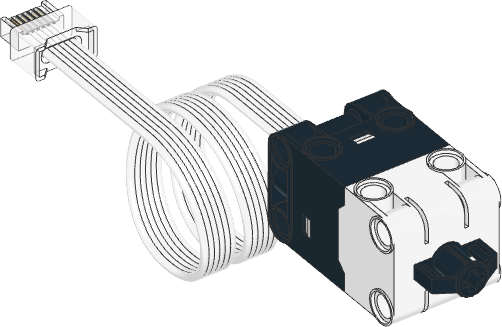

# Force Sensor

!!! learn "On this page we will learn"
    - how to measure how hard the force sensor is pressed
    - how to measure how far the button has moved in
    - how to tell whether the sensor is touched or pressed

!!! terms "Terminology"
    - **force sensor** – a sensor like a button that can tell whether it is touched or pressed and measure how hard it is pressed.
    - **newton** – the unit (N) used to measure force, where 1 N is roughly the force of holding a 100 g block of chocolate.
    - **threshold** – a set value that a reading must reach before the program counts it, such as the force needed for a press.

The force sensor is like a button that can also measure how hard it is being pressed. We press the black button on its front, and the sensor tells us whether it is touched or pressed, how much force is on it and how far the button has moved in.

Possible uses:

- a start button for the robot
- a bumper that detects when the robot hits something
- measuring how hard something is pushed
- a controller where a harder press means a faster speed



## Connect it

- See [Setup](../start/setup.md#create-and-run-a-program) for how to create and run each example.
- The force sensor is in **Port B**.
- **Force** is measured in **newtons** (N). The sensor measures up to about 10 N. As a guide, 1 N is roughly the force of holding a 100 g block of chocolate.
- **Distance** is how far the button has moved in, in millimetres. It moves up to about 8 mm.

## Set it up

We create a `ForceSensor` object and tell it which port the sensor is in:

```python linenums="1"
from pybricks.hubs import PrimeHub
from pybricks.pupdevices import Motor, ColorSensor, UltrasonicSensor, ForceSensor
from pybricks.parameters import Button, Color, Direction, Port, Side, Stop
from pybricks.robotics import DriveBase
from pybricks.tools import wait, StopWatch

# Setup
hub = PrimeHub()
force_sensor = ForceSensor(Port.B)
```

## Methods

| Method | Parameters | Returns | Description |
| --- | --- | --- | --- |
| `force()` | none | float (N) | How much force is on the button |
| `distance()` | none | float (mm) | How far the button has moved in |
| `pressed(force=3)` | `force`: N | Boolean | `True` if the force is at least the set amount |
| `touched()` | none | Boolean | `True` if the button is touched even slightly |

### `force()`

Returns how much force is pressing on the button, in newtons.

```python linenums="1"
--8<-- "examples/sensors/force/force/main.py"
```

!!! primm "PRIMM"
    1. **Predict** what you think will happen. Be specific.
    2. **Run** the program. Press the button gently, then harder.
    3. Time to **investigate** the code. What does each line do?

??? note "Code explanation"
    - **lines 1–5** → import the Pybricks commands for the hub, motors, sensors, settings and timing.
    - **line 8** → creates the hub and names it `hub`.
    - **line 9** → creates the force sensor in Port B and names it `force_sensor`.
    - **line 12** → starts the main loop, which repeats forever.
    - **line 13** → prints the force on the button in newtons.
    - **line 14** → waits 200 milliseconds so the terminal isn't flooded with readings.

### `distance()`

Returns how far the button has been pushed in, in millimetres.

```python linenums="1"
--8<-- "examples/sensors/force/distance/main.py"
```

!!! primm "PRIMM"
    1. **Predict** what you think will happen. Be specific.
    2. **Run** the program. Push the button in slowly, all the way.
    3. Time to **investigate** the code. What does each line do?

??? note "Code explanation"
    - **lines 1–5** → import the Pybricks commands for the hub, motors, sensors, settings and timing.
    - **line 8** → creates the hub and names it `hub`.
    - **line 9** → creates the force sensor in Port B and names it `force_sensor`.
    - **line 12** → starts the main loop, which repeats forever.
    - **line 13** → prints how far the button has moved in, in millimetres.
    - **line 14** → waits 200 milliseconds before the next reading.

### `pressed()`

Returns `True` if the button is pressed with at least a set amount of force. This amount is called a **threshold**. If we don't give one, the threshold is 3 N.

```python linenums="1"
--8<-- "examples/sensors/force/pressed/main.py"
```

!!! primm "PRIMM"
    1. **Predict** what you think will happen. Be specific.
    2. **Run** the program. Press the button gently, then harder.
    3. Time to **investigate** the code. What does each line do?

??? note "Code explanation"
    - **lines 1–5** → import the Pybricks commands for the hub, motors, sensors, settings and timing.
    - **line 8** → creates the hub and names it `hub`.
    - **line 9** → creates the force sensor in Port B and names it `force_sensor`.
    - **line 12** → starts the main loop, which repeats forever.
    - **line 13** → checks if the button is pressed with at least 5 N of force…
    - **line 14** → …if it is, turns the status light green.
    - **line 15** → if it isn't…
    - **line 16** → …turns the status light off.

### `touched()`

Returns `True` if the button is touched at all, even very lightly. It notices tiny movements that are too small for `pressed()`.

```python linenums="1"
--8<-- "examples/sensors/force/touched/main.py"
```

!!! primm "PRIMM"
    1. **Predict** what you think will happen. Be specific.
    2. **Run** the program. Touch the button as lightly as you can.
    3. Time to **investigate** the code. What does each line do?

??? note "Code explanation"
    - **lines 1–5** → import the Pybricks commands for the hub, motors, sensors, settings and timing.
    - **line 8** → creates the hub and names it `hub`.
    - **line 9** → creates the force sensor in Port B and names it `force_sensor`.
    - **line 12** → starts the main loop, which repeats forever.
    - **line 13** → checks if the button is being touched…
    - **line 14** → …if it is, turns the status light blue.
    - **line 15** → if it isn't…
    - **line 16** → …turns the status light off.

!!! tip "`touched()` or `pressed()`?"
    Use `touched()` for a bumper, where any contact matters. Use `pressed()` for a button, where we want a firm press so that brushing against it doesn't count.

## Documentation

Documentation is the official guide written by the people who made the code library, and we can use it to look up every method and its parameters, including ones that aren't covered on this page.

- [Pybricks — Force sensor](https://docs.pybricks.com/en/stable/pupdevices/forcesensor.html)

## Exercises

!!! primm "PRIMM"
    Time to **modify** the code and see what happens.

Starter files are in the `force` folder of your tutorial files. Solutions are on the [Exercise Solutions](../reference/solutions.md#force-sensor) page.

### Exercise 1

Starter: `force/ex1_force_meter`

Can you turn the robot into a force meter that shows the force on the display as a whole number of newtons? `int()` may help.

### Exercise 2

Starter: `force/ex2_start_button`

Can you use the force sensor as a start button? When it is pressed, the robot should drive forwards 300 mm and then back 300 mm.

### Exercise 3

Starter: `force/ex3_threshold`

Change the threshold in `pressed()` from `5` to `0`, then to `15`. What happens each time? Why do you think this happens?
