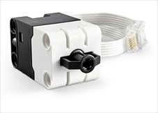
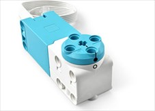

# Setup

In this course we will program a LEGO SPIKE Prime robot in Python. This page shows how to set up Pybricks, connect the robot, create and run a program, and check the robot is built correctly.


We will use three technologies that work together:

- **LEGO SPIKE Prime** → the robot hardware
- **Pybricks** → the software that runs on the robot, and the app we use to program it
- **Python** → the programming language we will write

!!! note "Pybricks"
    We have replaced the standard LEGO SPIKE **firmware** with Pybricks firmware because it runs Python better. The trade-off is that we can no longer use the LEGO SPIKE App to program the robot.

!!! note "Firmware"
    **Firmware** is like a robot's brain. It is special software built into the device that makes it work correctly every time we turn it on.

## Pybricks IDE

An **IDE** (Integrated Development Environment) is an app for writing and running code. The Pybricks IDE is where we will write and run our programs. We can use it in a browser or install it as an app. Either works fine.

**[https://code.pybricks.com/](https://code.pybricks.com/)**

If this is your first visit, take the **Welcome Tour** when prompted. If it doesn't appear, click the link in the left-hand menu.

## Connect the robot

1. Press and hold the power button on the hub (the big centre button).
    - The hub lights up nine squares and the power button flashes blue.
2. Click the **Bluetooth** button in the Pybricks IDE.
    - A pop-up list of nearby robots appears.
3. Choose your robot's name from the list. The name is on the front of the robot.
4. Click **Pair**.
    - The power button turns solid blue. We're connected!

## Create and run a program

We follow the same steps for every example on this site.

1. In the Pybricks IDE, click **Create a new file** and choose the Prime Hub icon.
    - Pybricks keeps all our programs in one list, so each one needs its own name.
2. Name the file. Use lower case and underscores, for example `status_light.py`.
    - The new file opens in the editor.
3. Type the code from the page into the file.
    - It's tempting to copy and paste, but typing the code helps it stick.
4. Click the **Run** button (the green play button).
    - The program is sent to the robot and starts running. Anything the program prints appears in the **terminal** at the bottom of the IDE.
5. Click the **Stop** button (or press the hub's centre button) to stop the program.

## Tutorial files

Every example and exercise starter file is in [lego_spike_tutorials.zip](../downloads/lego_spike_tutorials.zip).

1. Download the zip file and extract it.
    - We get a `lego_spike_tutorials` folder with one folder for each page of this site.
2. In the Pybricks IDE, click the **Import a file** button above the file list.
    - A file browser opens.
3. Open the folder for the page we're working on and choose the `.py` file we need.
    - The file is added to our program list, ready to run.

Each file is named after its page and example, for example `status_light_blink.py`, so the files never clash in Pybricks.

## Check the robot configuration

Our robot has three sensors and two motors plugged into specific ports. This program checks that everything is plugged into the right place.

| Device | Port | Purpose | Image |
| --- | --- | --- | --- |
| Force Sensor | B | Detects the amount of pressure applied |  |
| Ultrasonic Sensor | C | Detects the distance to an object in front |  |
| Colour Sensor | D | Detects the colour of an object, or the amount of light reflected |  |
| Motors | E and F | Turn the wheels in response to commands from the hub |  |

Create a new file called `check_config.py` and run the code below. Don't worry about understanding the code yet. We will learn it through these tutorials.

```python linenums="1"
--8<-- "examples/start/setup/check_config/main.py"
```

### Check the ports

Look at the terminal at the bottom of the IDE. It should show:

```
Hub configuration
Port.B :  SPIKE Force Sensor
Port.C :  SPIKE Ultrasonic Sensor
Port.D :  SPIKE Color Sensor
Port.E :  SPIKE Medium Angular Motor
Port.F :  SPIKE Medium Angular Motor
```

If anything is different, unplug the cables and move them until each device is in its correct port.

### Check the motors

The robot should turn 360° **clockwise**, then drive forwards 100 mm. If it turns **anticlockwise**, swap the cables in **Port E** and **Port F**.

- left motor → **Port E**
- right motor → **Port F**

## Start exploring

We're all set up! Keep these tips in mind as we work through the tutorials:

1. **Type the code**. Typing helps it stick.
2. **Use PRIMM**. Predict what the code will do before running it, then investigate and modify it.
3. **Read the callout boxes**. They explain key concepts and coding practices.
4. **Remix and build**. Treat the code like LEGO. Break it apart, mash pieces together and make something new.

!!! primm "PRIMM"
    Throughout this course we use the **PRIMM** process:

    - **Predict** → what do we think the code will do before we run it?
    - **Run** → run it and compare the result to our prediction.
    - **Investigate** → go through the code line by line. What does each part do?
    - **Modify** → change something and see what happens.
    - **Make** → use what we've learned to build something new.
